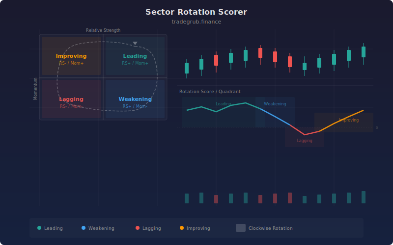

# Sector Rotation Scorer

The Sector Rotation Scorer computes a composite score for any symbol based on its relative strength ratio and momentum versus a price benchmark. It classifies the symbol into one of four rotation quadrants (Leading, Weakening, Lagging, Improving) to help identify where capital is flowing in real time.

## Conceptual Diagram



## How It Works

The indicator first calculates a relative strength ratio by dividing the current price by a simple moving average of the price over a configurable benchmark period. This ratio tells you whether the symbol is trading above or below its average. A smoothed version of this ratio removes noise and provides a stable trend reading.

Next, the indicator measures the rate of change (momentum) of the smoothed RS ratio over a separate lookback window. The direction of both the RS ratio and its momentum determines the quadrant assignment. Rising ratio with rising momentum places the symbol in the Leading quadrant. A rising ratio with falling momentum signals Weakening.

The final rotation score combines both components into a single numeric value centered around zero. Positive scores indicate relative strength versus the benchmark. Negative scores indicate relative weakness. Threshold crossovers at +5 and -5 generate visual markers on the chart.

## Parameters

| Name | Default | Range | Description |
|------|---------|-------|-------------|
| RS Length | 14 | 5 - 50 | Lookback for the relative strength calculation |
| Momentum Length | 10 | 3 - 30 | Period for measuring RS ratio rate of change |
| Smoothing | 5 | 1 - 20 | SMA smoothing applied to ratio, momentum, and final score |
| Benchmark Period | 20 | 5 - 100 | SMA length used as the price benchmark |
| Strong Threshold | 1.05 | 1.0 - 2.0 | RS ratio level considered strong (reference only) |
| Weak Threshold | 0.95 | 0.5 - 1.0 | RS ratio level considered weak (reference only) |
| Show Background Fill | True | on/off | Color the chart background based on quadrant |
| Show Quadrant Labels | True | on/off | Display triangle markers at score threshold crossovers |

## Python Advantage

Vectorized operations make the quadrant classification run across the entire series without loops:

```python
rising_rs = rs_smooth > rs_smooth.shift(1)
rising_mom = mom_smooth > mom_smooth.shift(1)

leading = rising_rs & rising_mom
weakening = rising_rs & ~rising_mom
lagging = ~rising_rs & ~rising_mom
improving = ~rising_rs & rising_mom
```

All four quadrant masks are computed in a single pass with boolean array operations, avoiding per-bar iteration entirely.

## When to Use

Apply this indicator when comparing a symbol's relative performance against its own moving average baseline. It works well on sector ETFs, individual stocks within a sector, or any asset where you want to track rotational flow. Shorter benchmark periods capture faster rotations. Longer periods smooth out noise and focus on sustained trends.

## Risk Management

The rotation score is a relative measure, not an absolute one. A symbol can be in the Leading quadrant while both it and the benchmark decline. Always confirm rotation signals with price action and volume. Avoid sizing positions based on the score alone. Use the quadrant transitions as timing filters rather than standalone entry triggers.

## Combining with Other Indicators

- **RSI or Stochastics:** Confirm that a Leading quadrant reading aligns with momentum that is not yet overbought. A symbol entering Leading with RSI below 70 has more room to run.
- **Volume Profile:** Validate rotation signals by checking whether volume supports the directional move. Quadrant shifts on declining volume are less reliable.
- **Moving Average Crossovers:** Use a fast/slow MA cross as the entry trigger and the rotation score as a directional filter. Only take long entries when the score is positive and rising.
