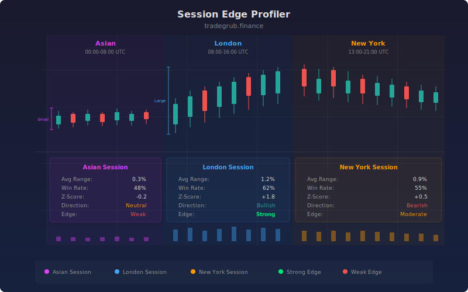

# Session Edge Profiler

A statistical analysis engine that profiles trading sessions (Asian, London, New York) across configurable time windows. It tracks range, volume, directional bias, and structure metrics per session, then builds statistical profiles using numpy to compute percentile rankings, z-scores, win rates, and session range ratios. Displays results as a comprehensive multi-session dashboard for identifying which sessions offer the strongest edges.

## Conceptual Diagram



## How It Works

The indicator segments each bar into one of three trading sessions based on configurable UTC hour boundaries. Asian session defaults to 00:00-08:00, London to 08:00-16:00, and New York to 13:00-21:00. Custom hours can be set for any market structure. Session masks are built using vectorized numpy conditionals, enabling efficient filtering of thousands of bars without loops.

For each session, rolling window statistics are computed using np.lib.stride_tricks.as_strided, which creates memory-efficient sliding views over the data. Within each window, the indicator calculates mean range, standard deviation, and percentile breakdowns (25th, 50th, 75th). Z-scores measure how unusual the current bar range is relative to session history. Win rate tracks the fraction of bars where price moved in the bullish direction.

A histogram-based distribution analysis scores each current value against the full historical distribution using CDF lookups via np.searchsorted. This gives a probability ranking that is more robust than simple percentile calculations for non-normal distributions. The histogram uses 20 bins by default, capturing the shape of the session range distribution.

The composite edge score combines z-score magnitude, histogram CDF rank, and bar wick ratio into a single metric. High edge scores indicate sessions where range behavior is statistically unusual and candle structure confirms directional conviction. Range ratios between sessions (London/Asian, NY/Asian) reveal relative volatility expansion patterns.

Background highlighting activates when any session z-score exceeds the configurable threshold (default 1.5), drawing attention to statistically extreme bars that may signal breakout or exhaustion conditions.

## Parameters

| Parameter | Default | Range | Description |
|-----------|---------|-------|-------------|
| Lookback Periods | 60 | 10-500 | Number of bars for rolling statistical calculations |
| Session Mode | 0 | 0-1 | 0 for standard forex sessions, 1 for custom hours |
| Asian Start Hour | 0 | 0-23 | UTC start hour for Asian session |
| Asian End Hour | 8 | 0-23 | UTC end hour for Asian session |
| London Start Hour | 8 | 0-23 | UTC start hour for London session |
| London End Hour | 16 | 0-23 | UTC end hour for London session |
| NY Start Hour | 13 | 0-23 | UTC start hour for New York session |
| NY End Hour | 21 | 0-23 | UTC end hour for New York session |
| Z-Score Alert Threshold | 1.5 | 0.5-4.0 | Z-score magnitude that triggers background highlighting |
| Show Percentile Rankings | true | - | Display median range lines per session |
| Show Z-Scores | true | - | Display z-score series per session |

## Python Advantage

```python
# Rolling window statistics using zero-copy stride tricks
def rolling_windows(arr, window):
    shape = (len(arr) - window + 1, window)
    strides = (arr.strides[0], arr.strides[0])
    return np.lib.stride_tricks.as_strided(arr, shape=shape, strides=strides)

# Histogram-based CDF scoring for non-normal distributions
hist_counts, bin_edges = np.histogram(valid_data, bins=20)
cdf = np.cumsum(hist_counts).astype(np.float64) / np.sum(hist_counts)
score = cdf[np.clip(np.searchsorted(bin_edges[1:], current_val), 0, len(cdf) - 1)]

# Vectorized session masking across entire price history
asian_mask = np.where((hours >= start) & (hours < end), 1.0, 0.0)
edge = np.clip(np.abs(zscore) * hist_score * (1 + wick_ratio), 0, 5)
```

This computation requires stride tricks for memory-efficient rolling windows, histogram-based distribution analysis with CDF lookups, and vectorized multi-session masking. None of these operations are possible in traditional scripting languages.

## When to Use

Best suited for forex, futures, and crypto markets where session boundaries create measurable volatility patterns. Use on 15-minute to 1-hour timeframes for session-level analysis. Most effective on instruments with clear session-driven behavior such as EUR/USD, GBP/USD, gold futures, and major index futures. Use during pre-session preparation to identify which upcoming session historically offers the strongest directional edge.

## Risk Management

Z-scores above 2.0 indicate unusual range expansion that could signal either breakout or exhaustion. Do not assume direction from range alone. Use the win rate metric to confirm directional bias before entering. Session edge scores are backward-looking and may not predict regime changes. Reduce position size when parameter divergence is high across sessions, as this indicates uncertain market structure.

## Combining with Other Indicators

- Pair with Volume Profile to confirm session range breakouts have volume support
- Use with VWAP to identify session-specific value areas and mean reversion zones
- Combine with ATR Percent to normalize session ranges across different instruments for portfolio-level session analysis
