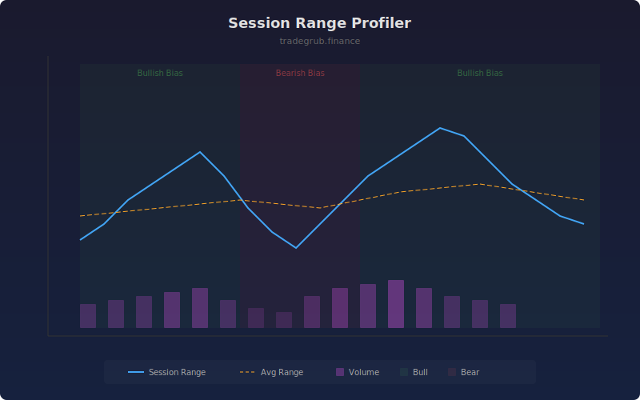

# Session Range Profiler

Profiles the total range, directional bias, and volume intensity for rolling sessions of configurable length. Helps identify whether sessions are expanding or contracting and which direction dominates volume flow.

## How It Works

- Calculates total bar range (high minus low sum) over the session window
- Compares current session range to the average of previous sessions
- Measures directional bias by comparing up-bar volume to down-bar volume
- Highlights bullish or bearish volume dominance with background shading
- Tracks volume intensity as the average volume within the session

## Parameters

| Parameter | Default | Range | Description |
|-----------|---------|-------|-------------|
| Session Length | 20 | 5-100 | Number of bars per session window |
| Show Direction | true | - | Background shading for directional bias |

## Outputs

- **Session Range**: Total range of the current session window
- **Avg Range**: Average range from the prior three sessions
- **Volume Intensity**: Mean volume within the session window
- **Background**: Green for bullish bias, red for bearish bias

## Usage Notes

- Range expanding above average suggests increasing volatility
- Strong directional bias with expanding range confirms trend momentum
- Low volume intensity with narrow range signals consolidation
