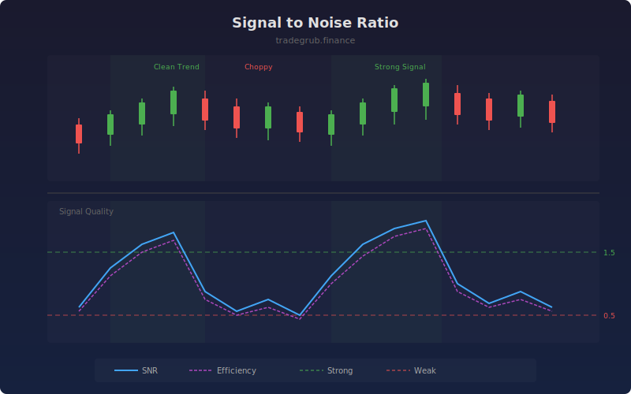

# Signal to Noise Ratio

Measures the quality of price movement by comparing directional progress to total movement. A high SNR means price is moving efficiently in one direction (trending), while a low SNR indicates choppy, indecisive action where most movement cancels itself out.

## How It Works

- Signal is measured as the net price change over the lookback window
- Noise is the sum of all individual bar ranges over the same window
- SNR divides signal by noise, scaled for readability
- Efficiency ratio provides a complementary 0-100 measure of path efficiency
- Green shading highlights periods of strong, clean directional movement

## Parameters

| Parameter | Default | Range | Description |
|-----------|---------|-------|-------------|
| Length | 14 | 5-100 | Lookback period for signal and noise measurement |
| Smoothing | 3 | 1-10 | Smoothing applied to output values |
| Strong Signal Threshold | 1.5 | 0.5-5.0 | Level above which signal is considered strong |

## Outputs

- **SNR**: Signal to noise ratio (blue line)
- **Efficiency Ratio**: Path efficiency from 0-100 (purple line)
- **Strong Signal**: Reference line for strong trend threshold (green dashed)
- **Weak Signal**: Reference line for weak/noisy threshold (red dashed)

## Usage Notes

- SNR above the strong signal line is ideal for trend-following strategies
- SNR below the weak signal line suggests ranging conditions, better for mean-reversion
- Combining SNR with direction indicators tells you both quality and direction of the trend
