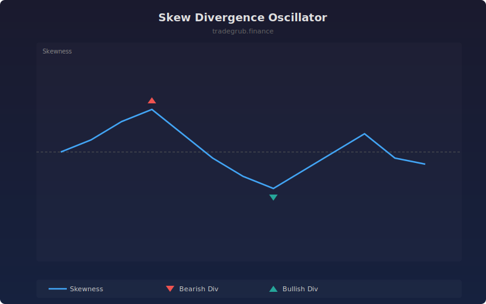

# Skew Divergence Oscillator

Tracks the realized skewness of log returns over a rolling window. Detects divergences when price makes new highs while the return distribution is negatively skewed, or new lows while positively skewed.

## How It Works

- Computes log returns from close prices
- Calculates rolling skewness using the third standardized moment: E[(x-mu)^3] / sigma^3
- Positive skewness means returns are right-tailed (bullish bias); negative means left-tailed (bearish bias)
- Bearish divergence: price at a new rolling high but skewness is negative
- Bullish divergence: price at a new rolling low but skewness is positive

## Parameters

| Parameter | Default | Range | Description |
|-----------|---------|-------|-------------|
| Lookback | 30 | 10-100 | Rolling window for skewness calculation and high/low detection |

## Outputs

- **Skewness**: Blue line showing rolling skewness of returns
- **Zero Line**: Gray baseline separating positive and negative skew
- **Bearish Divergence**: Red triangles when price highs conflict with negative skew
- **Bullish Divergence**: Green triangles when price lows conflict with positive skew

## Usage Notes

- Bearish divergences at new highs warn that the distribution is shifting against the trend
- Bullish divergences at new lows suggest selling pressure is fading despite lower prices
- Extreme skewness values beyond +/-1 indicate strong directional bias in the return distribution
