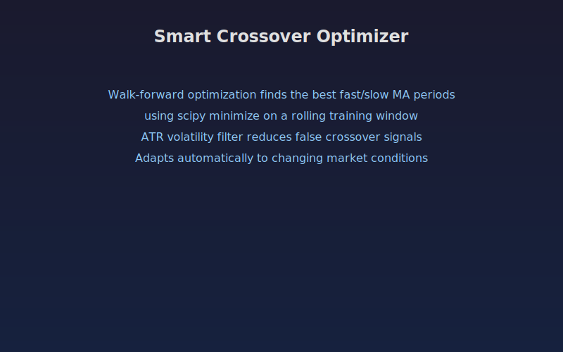

## Smart Crossover Optimizer

An adaptive moving average crossover indicator that uses walk-forward optimization to find the best fast and slow MA periods. Instead of fixed periods, the indicator periodically re-optimizes using scipy on a rolling training window, adjusting to changing market conditions automatically.

Crossover signals are filtered by ATR volatility to reduce false signals in choppy markets.

### Parameters

- **Training Window:** Number of bars used for optimization (default 100)
- **Min/Max Fast Period:** Range for the fast MA search (default 5 to 30)
- **Min/Max Slow Period:** Range for the slow MA search (default 20 to 100)
- **Re-optimize Every N Bars:** How often to re-run the optimizer (default 20)
- **ATR Filter Multiplier:** Minimum spread between MAs relative to ATR (default 2)
- **ATR Length:** Period for the ATR calculation (default 14)

### Signals

- **BUY label:** Fast MA crosses above slow MA with sufficient volatility spread
- **SELL label:** Fast MA crosses below slow MA with sufficient volatility spread
- **Green background:** Fast MA is above slow MA (uptrend)
- **Green line:** Optimized fast MA
- **Red line:** Optimized slow MA

The optimizer uses a coarse grid search followed by scipy bounded minimization to refine the best period combination that maximizes returns over the training window.

## Conceptual Diagram

