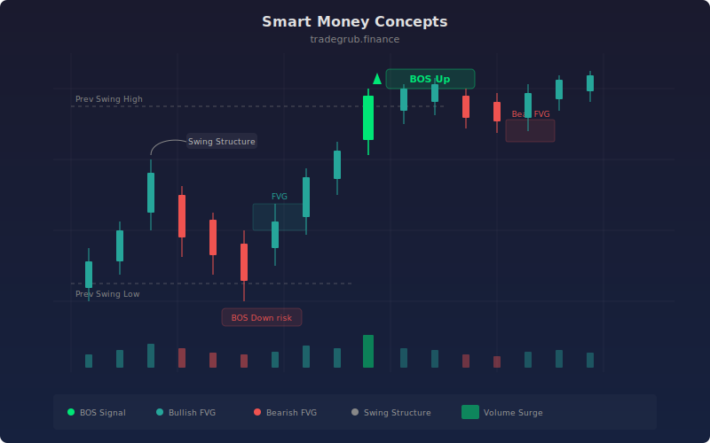

# Smart Money Concepts

Smart Money Concepts (SMC) is a price action framework that identifies institutional order flow patterns including Break of Structure (BOS), Fair Value Gaps (FVG), and swing structure levels. Originating from Inner Circle Trader (ICT) methodology and institutional market microstructure theory, SMC aims to reveal where large participants are likely accumulating or distributing positions by analyzing structural breaks and price imbalances left behind during aggressive moves.

## Conceptual Diagram



## How It Works

The indicator first establishes swing structure by computing the highest high and lowest low over a configurable swing length (default 5 bars). These rolling extremes define the structural levels that price must break to signal a change in market character. The previous swing levels are accessed via array indexing (`swing_high[swing_length]`), creating a lagged reference that represents the most recently confirmed structure.

Break of Structure (BOS) signals are generated when the close price crosses above a previous swing high (bullish BOS) or below a previous swing low (bearish BOS). A bullish BOS indicates that buyers have overwhelmed the prior resistance level, suggesting institutional buying pressure. A bearish BOS indicates sellers have broken through prior support. These are plotted as green up-triangles and red down-triangles respectively.

Fair Value Gaps (FVG) detect price imbalances where a candle's range does not overlap with the candle two bars prior, leaving a "gap" in the price auction. A bullish FVG occurs when the current bar's low is above the high of two bars ago (`low > high[2]`), indicating aggressive buying that left unfilled orders below. A bearish FVG occurs when the current bar's high is below the low of two bars ago. These gaps are highlighted with green or red background shading.

The combination of BOS and FVG provides a complete structural picture: BOS tells you the trend direction is shifting, while FVG tells you where institutional participants left unfilled orders that price may revisit. Traders often look for price to return to FVG zones after a BOS for high-probability entries.

## Parameters

| Parameter | Default | Range | Description |
|-----------|---------|-------|-------------|
| Swing Length | 5 | 2 - 20 | Lookback bars for swing high/low detection |
| Show Break of Structure | true | Boolean | Display BOS triangle markers on crossovers |
| Show Fair Value Gaps | true | Boolean | Highlight FVG imbalance zones with background color |

## Python Advantage

The structural analysis uses array indexing and boolean comparisons that operate across the entire price history in vectorized passes:

```python
# Rolling swing structure via vectorized highest/lowest
swing_high = ta.highest(high, swing_length)
swing_low = ta.lowest(low, swing_length)

# Lagged structure levels via array indexing
prev_high = swing_high[swing_length]
prev_low = swing_low[swing_length]

# BOS detection as vectorized crossover on full arrays
bos_up = ta.crossover(close, prev_high)
bos_down = ta.crossunder(close, prev_low)

# FVG detection via offset array comparison — no loop needed
fvg_bull = low > high[2]   # Current low above high 2 bars ago
fvg_bear = high < low[2]   # Current high below low 2 bars ago
```

The array offset syntax `high[2]` accesses the entire price series shifted by 2 bars as a single array operation. Combined with the boolean comparison operators, this detects all Fair Value Gaps across the entire dataset simultaneously. In Pine, the `[]` operator works bar-by-bar; in Python, it produces a shifted array enabling vectorized comparison across thousands of bars at once. You could extend this with `np.sum(fvg_bull[-20:])` to count recent FVG frequency for confluence scoring.

## When to Use

Smart Money Concepts work best on liquid instruments with significant institutional participation: large-cap equities, major forex pairs, index futures, and popular crypto pairs. Use it on 15-minute to daily timeframes. The framework is most effective during active sessions when institutional order flow is heaviest. Avoid using it on thinly traded instruments where price gaps may reflect low liquidity rather than intentional institutional positioning.

## Risk Management

Enter at FVG zones after a BOS confirmation, with stops placed beyond the opposite side of the FVG zone. The FVG itself defines the risk: if price fills the gap entirely and continues through, the trade thesis is invalidated. BOS signals alone are not sufficient for entries, as many structural breaks fail and reverse. Wait for price to return to a nearby FVG or swing level before committing capital. Position size based on the distance from entry to the far edge of the FVG.

## Combining with Other Indicators

- **Volume Profile POC**: When a Fair Value Gap aligns with the Point of Control, the confluence of structural imbalance and high-volume support creates a particularly strong entry zone.
- **Fibonacci Bands**: Look for FVG zones that coincide with key Fibonacci retracement levels (38.2%, 61.8%) for multi-factor confluence.
- **Trend Strength**: Use the Trend Strength score to filter BOS signals, only acting on structural breaks when the multi-factor trend score confirms strong directional conviction.
