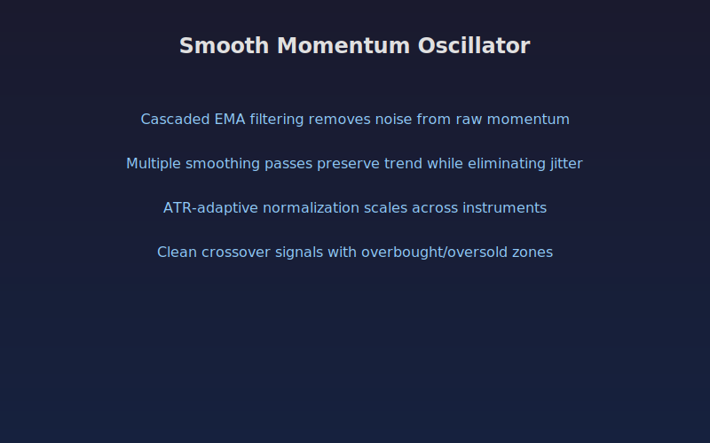

## Smooth Momentum Oscillator

A noise-free momentum oscillator that applies cascaded exponential smoothing
to raw momentum values. Multiple passes of EMA filtering remove market noise
while preserving trend responsiveness, producing clean crossover signals.

The indicator normalizes momentum relative to ATR for adaptive scaling
across different instruments and timeframes.

### Parameters

- **Momentum Length:** Number of bars for raw momentum calculation (default 10)
- **Smoothing Passes:** How many times the EMA cascade is applied (default 3)
- **Smoothing Period:** Length of each EMA pass (default 8)
- **Signal Line Length:** EMA period for the signal line (default 5)
- **Overbought Level:** Upper threshold for zone shading (default 60)
- **Oversold Level:** Lower threshold for zone shading (default -60)

### Signals

- **Bullish crossover (B label):** Smooth momentum crosses above the signal line
- **Bearish crossover (S label):** Smooth momentum crosses below the signal line
- **Overbought zone:** Red background shading when momentum exceeds the upper threshold
- **Oversold zone:** Green background shading when momentum falls below the lower threshold
- **Histogram:** Difference between momentum and signal line, green when positive, red when negative

## Conceptual Diagram

