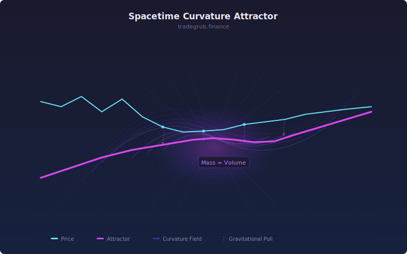

# Spacetime Curvature Attractor

Physics-inspired mean reversion indicator. Models price as a particle in a gravitational field where volume concentration creates "mass" and price acceleration creates "curvature." When the attractor force exceeds a threshold, price is being pulled back toward its mean.

## Conceptual Diagram

## Parameters

| Parameter | Type  | Default | Range    | Description                          |
|-----------|-------|---------|----------|--------------------------------------|
| Lookback  | int   | 30      | 5-200    | Rolling window for mean and mass     |
| Threshold | float | 2.0     | 0.1-10.0 | Force level triggering reversion signal |

## Signals

- **Attractor Force (blue):** Computed as mass times curvature divided by squared distance from mean
- **Distance from Mean (orange):** Current price deviation from rolling mean as a percentage
- **Green triangle:** Attractor pulling price up (price below mean, force exceeds threshold)
- **Red triangle:** Attractor pulling price down (price above mean, force exceeds threshold)

## Usage

When price extends far from its rolling mean and volume concentrates while acceleration reverses, the attractor force spikes, signaling high probability of mean reversion. Larger threshold values produce fewer but higher-confidence signals. Combine with support/resistance levels to confirm reversion targets. Works best in range-bound or mean-reverting instruments.
