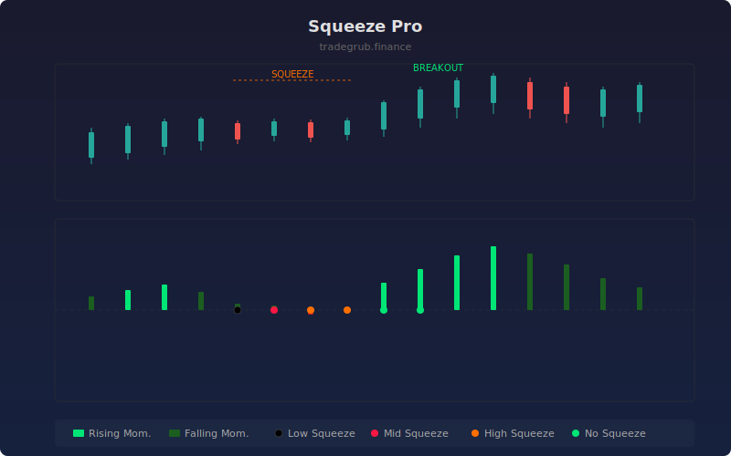

# Squeeze Pro

Enhanced squeeze detection indicator that identifies periods of low volatility compression using multiple Bollinger Band and Keltner Channel relationships. When the Bollinger Bands contract inside the Keltner Channels, a "squeeze" is on, signaling an impending breakout with a color-coded momentum histogram.

## How It Works

- Compares Bollinger Bands against three Keltner Channel widths (low, mid, high) to detect squeeze intensity
- A low squeeze occurs when BB fits inside the narrow KC; mid and high squeezes indicate progressively tighter compression
- Momentum is derived from price deviation relative to the midpoint of the highest-high/lowest-low range and EMA
- Histogram bars are color-coded: bright green/red for increasing momentum, dark green/red for decreasing
- Squeeze dots on the zero line indicate squeeze state

## Parameters

| Parameter | Default | Range | Description |
|-----------|---------|-------|-------------|
| BB Length | 20 | 5-50 | Bollinger Band period |
| BB Multiplier | 2.0 | 0.5-4.0 | Bollinger Band multiplier |
| KC Length | 20 | 5-50 | Keltner Channel period |
| KC Mult Low | 1.5 | 0.5-3.0 | Low squeeze Keltner multiplier |
| KC Mult Mid | 2.0 | 1.0-4.0 | Mid squeeze Keltner multiplier |
| KC Mult High | 3.0 | 1.5-5.0 | High squeeze Keltner multiplier |

## Outputs

- **Momentum histogram (blue)**: Direction and strength of momentum
- **Zero line**: Squeeze state reference
- **Dashed zero line**: Neutral reference

## Usage Notes

- Look for squeeze conditions followed by momentum expansion for breakout trades
- The tighter the squeeze (higher level), the more explosive the expected breakout
- Momentum direction after squeeze release indicates the likely breakout direction
