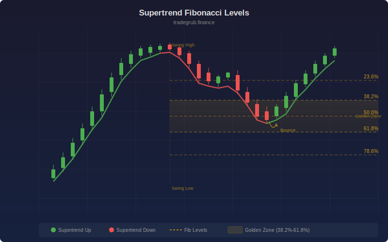

# Supertrend Fibonacci Levels

Combines the Supertrend trend indicator with automatic Fibonacci retracement levels. When the Supertrend flips direction, the swing high and low are captured and Fibonacci levels (23.6%, 38.2%, 50%, 61.8%, 78.6%) are projected as potential support and resistance within the current trend.

## Conceptual Diagram

## Parameters

- **ATR Length** (1-50, default 10): Period for ATR calculation
- **Factor** (0.5-10, default 3.0): Supertrend multiplier
- **Show Fibonacci Levels** (default on): Toggle Fibonacci level display

## Signals

- **Supertrend line**: Green in uptrend, red in downtrend
- **Fibonacci levels**: Horizontal lines showing retracement targets within the current swing
- **50% level (blue)**: Key mean reversion target
- **38.2% and 61.8% levels**: Primary Fibonacci support/resistance

## Use Cases

- Find pullback entry levels within a Supertrend-defined trend
- Set take-profit targets at Fibonacci extensions
- Identify trend exhaustion when price fails to hold key Fibonacci levels
