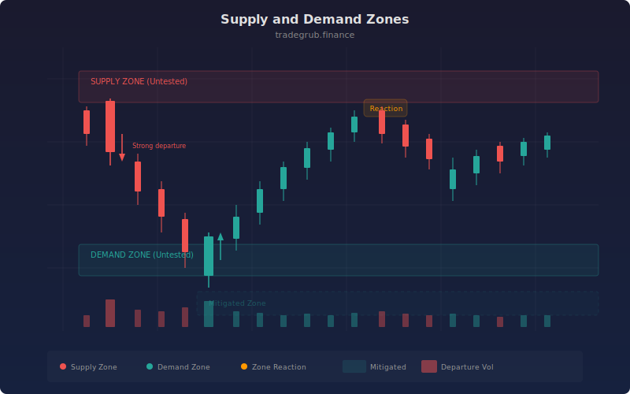

# Supply Demand Zones

Supply and demand zones mark price levels where institutional orders created strong departures from consolidation. This indicator automatically detects those zones, tracks whether price has returned to test them, and highlights untested zones that are most likely to produce a reaction on the next visit.

## Conceptual Diagram



## How It Works

The indicator scans for candles where price departed sharply from a local extreme. A supply zone forms when a bearish candle at a lookback-period high produces a body larger than a multiple of ATR. A demand zone forms under the same logic at a lookback-period low with a bullish candle. The open-to-high range (supply) or low-to-open range (demand) defines the zone boundaries.

Each zone is tracked bar by bar. If price closes beyond the zone boundary (above a supply zone or below a demand zone), that zone is marked as mitigated. Mitigated zones can optionally be dimmed rather than removed, giving you a visual history of levels that have already been tested.

The indicator caps the number of active zones per side to keep the chart clean. Older mitigated zones are pruned automatically while fresh untested zones remain visible.

## Parameters

| Name | Default | Range | Description |
|------|---------|-------|-------------|
| Lookback | 20 | 5 - 100 | Window for detecting local highs and lows |
| ATR Length | 14 | 5 - 50 | Period for the ATR calculation used in departure threshold |
| Departure Strength | 2.0 | 1.0 - 5.0 | ATR multiplier that qualifies a candle as a strong departure |
| Max Zones | 5 | 1 - 20 | Maximum number of zones displayed per side |
| Zone Opacity | 80 | 10 - 100 | Fill opacity for active zone highlighting |
| Show Supply Zones | true | bool | Toggle visibility of supply (resistance) zones |
| Show Demand Zones | true | bool | Toggle visibility of demand (support) zones |
| Dim Mitigated Zones | true | bool | Keep mitigated zones visible at reduced opacity |

## Python Advantage

Zone detection benefits from vectorized boolean logic to identify departure candles in a single pass:

```python
atr = ta.atr(atr_len)
threshold = atr * strength
bearish_departure = (open - close > threshold) & (high == ta.highest(high, lookback))
bullish_departure = (close - open > threshold) & (low == ta.lowest(low, lookback))
```

This computes departure signals across the entire series without explicit loops, then the tracking loop handles zone lifecycle management.

## When to Use

Supply and demand zones work best on instruments with clear institutional participation: large-cap stocks, major forex pairs, and liquid futures. Use them to identify high-probability reversal areas for entries, or to set stop-loss levels just beyond the zone boundary. They are most effective on the 1-hour timeframe and above, where the zones reflect meaningful order flow rather than noise.

## Risk Management

Always place stops beyond the far edge of the zone, not at the near edge. A zone that holds will typically produce a reaction before price reaches the opposite boundary. If price closes through the zone entirely, the level is mitigated and you should exit. Position size according to the distance from entry to stop, not the zone width alone.

## Combining with Other Indicators

- **Volume Profile:** Overlay a volume profile to confirm that a supply or demand zone aligns with a high-volume node, increasing the probability of a reaction.
- **RSI Divergence:** Look for RSI divergence as price approaches an untested zone. Divergence at a demand zone or overbought RSI at a supply zone adds confluence.
- **ATR Bands:** Use ATR-based bands to gauge whether the current volatility supports a zone test or a breakout. Narrow ATR near a zone suggests a higher chance of reversal.
