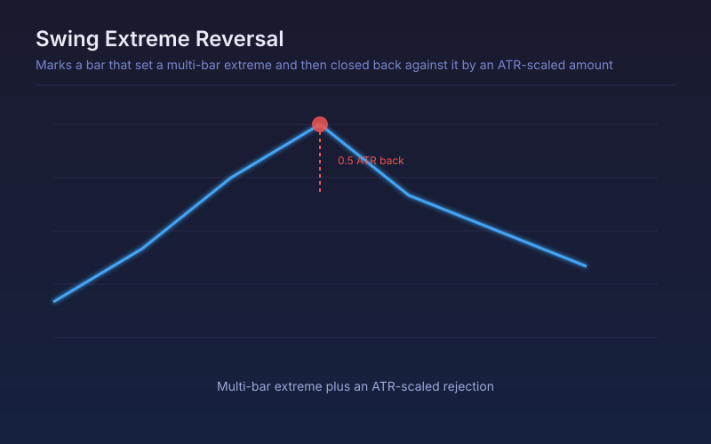

# Swing Extreme Reversal

Marks a bar that set a multi-bar extreme and then closed back against it by an ATR-scaled amount, which is a reversal that confirmed rather than one that was guessed.

## Conceptual Diagram

## Parameters

| Parameter | Default | Range | Description |
|-----------|---------|-------|-------------|
| Extreme lookback | 20 | 3-200 | Bars the extreme must exceed to count as a swing extreme |
| ATR length | 14 | 2-100 | ATR length used to scale the rejection distance |
| Rejection in ATR | 0.5 | 0.1-3.0 | How far price must travel back from the extreme to confirm |
| Confirmation bars | 2 | 1-10 | Bars allowed after the extreme for the rejection to complete |

## Signals

- Reversal down: a new multi-bar high, followed within the confirmation window by a close an ATR-fraction below it
- Reversal up: a new multi-bar low, followed by a close an ATR-fraction above it
- No signal on an extreme that price simply keeps extending, which is the point of requiring the rejection
- Signals cluster near the end of extended moves and thin out in the middle of trends

## Usage

Use as a confirmation filter rather than an entry trigger: the signal arrives a couple of bars after the extreme by construction, which is the cost of only marking reversals that actually reversed. Raise the rejection multiple in choppy markets and lower it in quiet ones.
