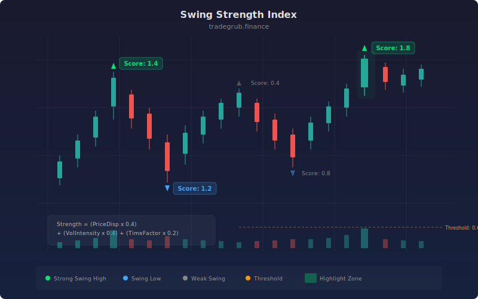

# Swing Strength Index

The Swing Strength Index scores each swing high and swing low by combining three factors: price displacement, volume intensity, and time duration. Rather than simply identifying swings, it ranks them by significance so traders can focus on the pivots that matter most.

## Conceptual Diagram



## How It Works

The indicator detects local swing highs and lows using a configurable lookback window. At each detected pivot, it calculates a composite score from three normalized components. Price displacement measures how far price moved relative to ATR, volume intensity compares the bar's volume to its recent average, and the time factor provides a baseline weight.

These three components are combined using user-defined weights that must sum to 1.0 for proper normalization. The raw composite score is then smoothed with an EMA to reduce noise. Swings scoring above the significance threshold are marked on the chart with directional arrows, making it easy to spot the strongest pivots at a glance.

A background highlight activates when strength exceeds 1.5 times the threshold, signaling an unusually powerful swing point. This helps identify potential reversal zones or breakout levels that carry above-average conviction.

## Parameters

| Name | Default | Range | Description |
|------|---------|-------|-------------|
| Swing Length | 5 | 2 - 20 | Lookback period for detecting swing pivots |
| Volume Weight | 0.4 | 0.0 - 1.0 | Weight assigned to volume intensity in the score |
| Price Weight | 0.4 | 0.0 - 1.0 | Weight assigned to price displacement in the score |
| Time Weight | 0.2 | 0.0 - 1.0 | Weight assigned to the time duration factor |
| ATR Period | 14 | 5 - 50 | Period for ATR and average volume calculations |
| Smoothing Length | 3 | 1 - 10 | EMA smoothing applied to the raw strength score |
| Show Swing Markers | True | on/off | Toggle visibility of swing high/low markers |
| Significance Threshold | 0.6 | 0.1 - 2.0 | Minimum score to qualify as a significant swing |

## Python Advantage

Vectorized operations make the scoring calculation fast and readable:

```python
price_disp = ta.change(close, swing_len).abs() / atr
vol_intensity = volume / avg_vol

raw_score = (price_disp * price_weight) + (vol_intensity * vol_weight) + (time_factor * time_weight)
strength = ta.ema(raw_score, smooth_len)
```

All three scoring components compute across the entire series in a single pass with no per-bar loops required.

## When to Use

The Swing Strength Index works best on daily and 4-hour charts where swing structure is well-defined. Use it to filter out noise swings and focus on pivots backed by strong volume and meaningful price movement. It is particularly useful for swing traders who need to rank support and resistance levels by quality rather than treating all pivots equally.

## Risk Management

High-scoring swings suggest strong conviction at a price level, but they are not trade signals on their own. Always confirm with price action context and use stops placed beyond the scored swing point. A swing with a high score that fails (price breaks through it) often signals a powerful move in the breakout direction, so plan for that scenario.

## Combining with Other Indicators

- **ATR or volatility bands:** Use ATR-based stops sized to the swing's strength score. Stronger swings justify tighter stops since the level has more structural support.
- **RSI or momentum oscillators:** A high-scoring swing low paired with oversold RSI readings adds confluence for a potential reversal entry.
- **Volume profile:** Compare scored swing levels against volume profile nodes. Swings that align with high-volume nodes represent the most defended price levels.
