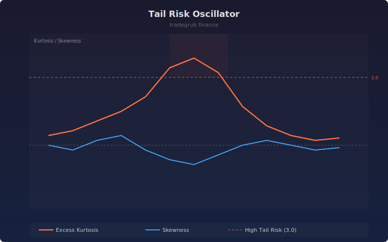

# Tail Risk Oscillator

Measures the excess kurtosis (fat tails) and skewness of the return distribution over a rolling window. High kurtosis indicates fragile market conditions where extreme moves are more likely than a normal distribution would predict.

## How It Works

- Computes log returns from close prices
- Calculates rolling excess kurtosis: E[(x-mu)^4] / sigma^4 - 3
- Calculates rolling skewness for directional bias of the tails
- Excess kurtosis above 0 means fatter tails than normal; above 3 signals elevated tail risk
- Skewness shows whether the fat tails lean bullish (positive) or bearish (negative)

## Parameters

| Parameter | Default | Range | Description |
|-----------|---------|-------|-------------|
| Lookback | 50 | 20-200 | Rolling window for kurtosis and skewness computation |

## Outputs

- **Excess Kurtosis**: Orange line showing tail fatness
- **Skewness**: Blue line showing directional tail bias
- **High Tail Risk**: Red dashed line at 3
- **Zero Line**: Gray baseline
- **Background**: Red shading when kurtosis exceeds 3

## Usage Notes

- Kurtosis above 3 with negative skewness warns of left-tail crash risk
- Kurtosis above 3 with positive skewness suggests explosive upside potential
- Falling kurtosis from elevated levels indicates normalizing conditions
- Longer lookback periods produce smoother but slower-reacting readings
