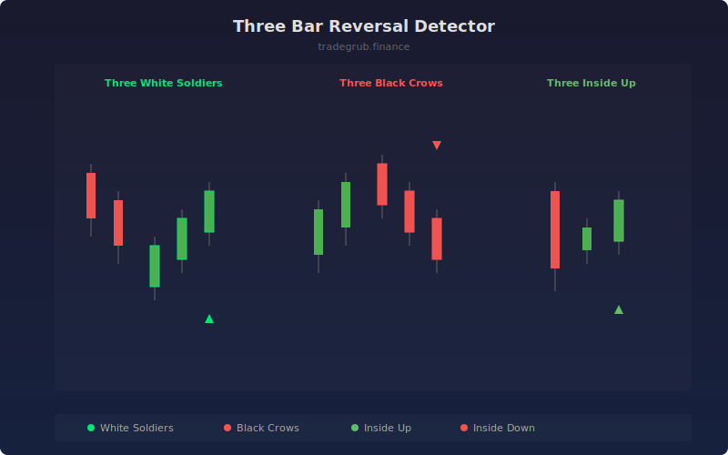

# Three Bar Reversal Detector

Scans for powerful three-bar reversal formations that signal potential trend changes. Detects three white soldiers, three black crows, three inside up, and three inside down patterns with configurable body size requirements.

## How It Works

- Three White Soldiers: Three consecutive bullish candles with progressively higher closes and opens within prior bodies
- Three Black Crows: Three consecutive bearish candles with progressively lower closes and opens within prior bodies
- Three Inside Up: Bearish candle followed by smaller bullish harami then bullish confirmation breaking above
- Three Inside Down: Bullish candle followed by smaller bearish harami then bearish confirmation breaking below
- Each candle must meet minimum body-to-range ratio to filter out weak or indecisive bars

## Parameters

| Parameter | Default | Range | Description |
|-----------|---------|-------|-------------|
| Min Body % of Range | 0.5 | 0.2-0.9 | Minimum body size relative to candle range |
| Show Three White Soldiers | true | - | Toggle soldiers pattern detection |
| Show Three Black Crows | true | - | Toggle crows pattern detection |
| Show Three Inside Up/Down | true | - | Toggle inside reversal detection |

## Outputs

- **Three White Soldiers**: Bright green triangles below bullish reversal bars
- **Three Black Crows**: Red triangles above bearish reversal bars
- **Three Inside Up/Down**: Lighter colored triangles for inside reversals
- **Pattern Score**: Numeric value indicating pattern type and direction

## Usage Notes

- Soldiers and crows are strongest when appearing after extended trends in the opposite direction
- Three inside patterns offer earlier entry signals but may be less reliable than soldiers/crows
- Combine with volume increasing on each successive bar for higher conviction signals
