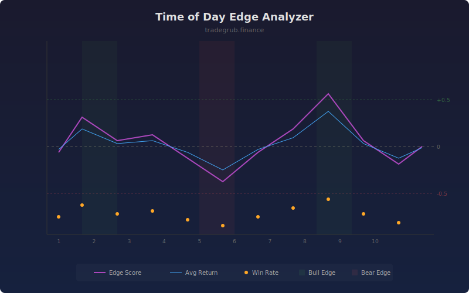

# Time of Day Edge Analyzer

Analyzes returns by bar position within a repeating cycle to find recurring statistical edges. By grouping bars into positional bins and measuring historical returns at each position, it reveals time-based patterns in price behavior.

## How It Works

- Divides bars into positional bins using modular arithmetic
- Collects historical returns for bars at the same position within the lookback
- Calculates mean return, win rate, and risk-adjusted edge score per position
- Edge score normalizes mean return by standard deviation for significance
- Highlights positions with strong bullish or bearish statistical edges

## Parameters

| Parameter | Default | Range | Description |
|-----------|---------|-------|-------------|
| Bar Position Bins | 10 | 4-50 | Number of positional bins in each cycle |
| Lookback Periods | 100 | 20-500 | Historical bars to analyze |
| Show Average Return | true | - | Display the average return line |

## Outputs

- **Edge Score**: Risk-adjusted return score per position (mean/std)
- **Avg Return %**: Mean return at the current bar position
- **Win Rate %**: Percentage of positive returns at this position
- **Background**: Shading for strong bullish or bearish edges

## Usage Notes

- On intraday charts, bins correspond to time-of-day periods
- Edge scores above 0.5 or below -0.5 suggest statistically significant patterns
- Use larger lookback for more stable readings, smaller for recent regime detection
