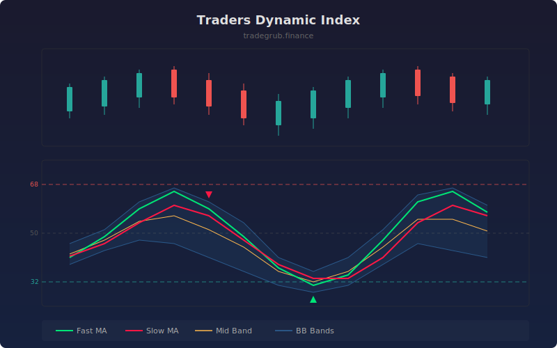

# Traders Dynamic Index

Composite indicator that combines RSI with Bollinger Bands applied to the RSI and two RSI-based moving averages. It provides a unified view of trend direction, momentum strength, and market volatility in a single oscillator panel.

## How It Works

- Calculates RSI over a configurable period as the base signal
- Applies Bollinger Bands to the RSI to measure RSI volatility and identify squeeze conditions
- Plots a fast MA and slow MA of the RSI for crossover-based entry signals
- Bullish when fast MA crosses above slow MA; bearish on the opposite cross
- Bollinger Band width on RSI reflects how volatile momentum is

## Parameters

| Parameter | Default | Range | Description |
|-----------|---------|-------|-------------|
| RSI Length | 13 | 2-50 | Period for RSI calculation |
| Band Length | 34 | 5-100 | Bollinger Band period applied to RSI |
| Band Multiplier | 1.6185 | 0.5-4.0 | Bollinger Band standard deviation multiplier |
| Fast MA Length | 2 | 1-20 | Fast moving average of RSI |
| Slow MA Length | 7 | 2-50 | Slow moving average of RSI |

## Outputs

- **Fast MA (green)**: Short-term RSI trend line
- **Slow MA (red)**: Longer-term RSI trend line
- **Mid Band (orange)**: Bollinger midline of RSI
- **Upper/Lower Bands (blue)**: Bollinger Bands on RSI
- **Triangles**: Crossover buy/sell signals

## Usage Notes

- Fast MA crossing above slow MA below the 50 midline suggests a strong bullish reversal
- When bands contract tightly, expect a momentum breakout
- The 68 and 32 levels serve as overbought and oversold references
