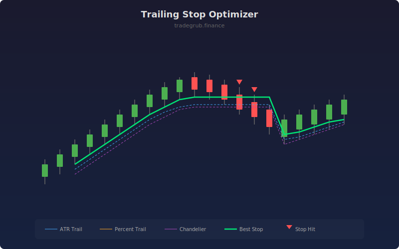

# Trailing Stop Optimizer

Compares multiple trailing stop methods side by side to help identify the optimal exit approach for current market conditions. Displays ATR-based, percentage-based, and chandelier trailing stops simultaneously, highlighting the tightest protective level.

## How It Works

- Calculates ATR-based trailing stop as highest close minus ATR times multiplier
- Calculates percentage-based trailing stop as highest close minus a fixed percentage
- Calculates chandelier stop as highest high minus ATR times multiplier
- Selects the highest (tightest) stop level as the "best stop" at each bar
- Marks bars where price closes below the best stop level

## Parameters

| Parameter | Default | Range | Description |
|-----------|---------|-------|-------------|
| ATR Length | 14 | 5-50 | Period for ATR calculation |
| ATR Multiplier | 3.0 | 1.0-6.0 | Multiplier applied to ATR for stop distance |
| Percent Stop % | 2.0 | 0.5-10.0 | Fixed percentage trailing stop distance |
| Show Chandelier Stop | true | - | Toggle chandelier stop display |

## Outputs

- **ATR Trail**: Blue line showing ATR-based trailing stop
- **Percent Trail**: Orange line showing percentage trailing stop
- **Chandelier**: Purple line showing chandelier exit
- **Best Stop**: Green line showing the tightest stop of all methods
- **Stop Hit**: Red triangles where price breaks below the best stop

## Usage Notes

- The best stop (green) automatically selects the most protective level at each bar
- In trending markets, wider ATR stops may preserve more profit than tight percentage stops
- Red triangles indicate potential exit points where the trailing stop was breached
