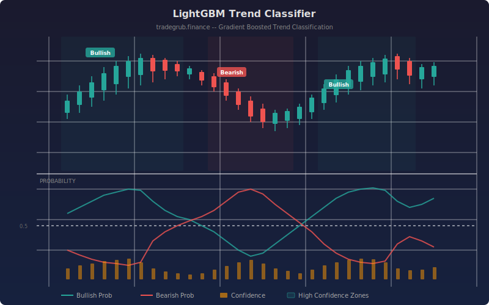

# Gradient Boosted Trend Classifier

A gradient boosted classification indicator that uses LightGBM to identify bullish, bearish, and neutral market regimes. The model trains on engineered features derived from price action, volatility, volume, and momentum, then outputs probability scores and confidence levels for each bar.

## Conceptual Diagram



## How It Works

The indicator constructs six features from raw OHLCV data: multi-period returns over 5, 10, and 20 bars capture trend strength at different time horizons; ATR normalized by close price measures relative volatility; volume divided by its SMA reveals participation surges or dryups; and a gains-to-losses ratio over 14 bars provides momentum context. These features feed into a LightGBM gradient boosted decision tree classifier.

Labels for training are derived from forward 10-bar returns. If the future return exceeds a configurable threshold, the bar is labeled bullish. If it falls below the negative threshold, it is labeled bearish. Returns within the neutral zone receive a neutral label. The model trains on the first portion of the dataset (controlled by training split) and predicts across all bars with valid features.

The output includes three series: bullish probability, bearish probability, and a confidence score defined as the gap between the highest and second-highest class probabilities. High confidence combined with a dominant probability signals a strong regime classification. Feature importance values are logged so you can see which inputs drive the model's decisions.

## Parameters

| Parameter | Default | Range | Description |
|-----------|---------|-------|-------------|
| ATR Length | 14 | 2 to 50 | Lookback period for Average True Range calculation |
| Volume SMA Length | 20 | 5 to 100 | Period for volume moving average normalization |
| Training Split | 0.7 | 0.3 to 0.9 | Fraction of data used for model training |
| Neutral Threshold | 0.02 | 0.001 to 0.1 | Minimum absolute forward return to classify as bullish or bearish |
| Num Estimators | 100 | 10 to 500 | Number of boosted trees in the ensemble |
| Show Regime Labels | true | on/off | Display text labels at regime change points |
| Label Cooldown | 15 | 1 to 50 | Minimum bars between consecutive regime labels |

## Outputs

**Bullish Probability (green line):** The model's estimated probability that the current bar belongs to a bullish regime. Values above 0.5 indicate the model favors an uptrend classification.

**Bearish Probability (red line):** The model's estimated probability of a bearish regime. Values above 0.5 indicate the model favors a downtrend classification.

**Confidence Score (orange line):** The difference between the top two class probabilities. Higher values mean the model is more decisive. A confidence above 0.3 combined with a dominant probability triggers colored background zones on the chart.

## Python Advantage

LightGBM requires Python for its gradient boosting implementation. The indicator leverages numpy for feature engineering and the lightgbm library for fast tree-based classification:

```python
model = lgb.LGBMClassifier(
    n_estimators=n_estimators,
    max_depth=5,
    learning_rate=0.05,
    num_leaves=31,
    min_child_samples=10,
    verbosity=-1,
    random_state=42,
)
model.fit(X_train, y_train)
probs = model.predict_proba(X_pred)
```

This approach would not be possible in Pine, which lacks access to machine learning libraries and general-purpose numerical computing.

## When to Use

Use this indicator on daily or higher timeframes where trend classification is most meaningful. It works best on liquid instruments with consistent volume data. The model retrains each time the indicator loads, so results adapt to the specific instrument's historical behavior. Keep the training split high enough (0.6 or above) to give the model sufficient data, but remember that predictions on the training set may appear overly accurate. Focus on the out-of-sample portion for realistic performance assessment.

## Risk Management

Machine learning predictions are not guarantees. The model can overfit to historical patterns that do not repeat. Always combine its signals with risk controls: position sizing, stop losses, and awareness of upcoming catalysts that the model cannot anticipate. Monitor the confidence score and avoid acting on low-confidence classifications.

## Combining with Other Indicators

- **Volume Profile:** Confirm high-confidence bullish signals by checking whether price sits near a high-volume node that could act as support.
- **ATR Bands:** Use ATR-based envelopes to set stop levels when the classifier identifies a trend regime, adjusting distance based on current volatility.
- **RSI or Stochastic:** Filter regime labels by requiring momentum oscillators to align, reducing whipsaw signals during choppy markets.
- **Moving Average Crossover:** Use a simple or exponential MA cross as an entry trigger only when the classifier's bullish or bearish probability exceeds 0.5 with adequate confidence.
