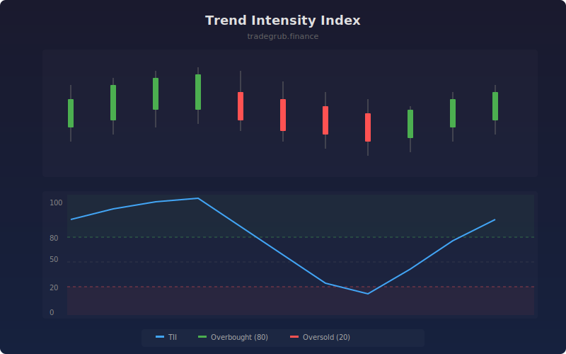

# Trend Intensity Index

The Trend Intensity Index (TII) measures trend strength by counting the percentage of closes above or below a moving average over a lookback period. Values above 80 indicate strong uptrends while values below 20 indicate strong downtrends, with the midline at 50 representing no directional bias.

## How It Works

- Calculates a moving average (SMA or EMA) of the closing price over the selected period
- Counts how many closes in the period are above vs below the moving average
- Converts the ratio to a 0-100 scale where 100 means all closes were above the MA
- Applies a 5-period EMA smoothing to reduce noise
- Highlights overbought and oversold zones with background shading

## Parameters

| Parameter | Default | Range | Description |
|-----------|---------|-------|-------------|
| Period | 20 | 5-100 | Lookback window for counting closes |
| MA Type | 1 | 1-2 | 1 for SMA, 2 for EMA |
| Overbought | 80 | 50-100 | Upper threshold for strong uptrend |
| Oversold | 20 | 0-50 | Lower threshold for strong downtrend |

## Outputs

- **TII**: Main oscillator line (0-100 scale)
- **Overbought/Oversold Lines**: Horizontal reference levels
- **Background Shading**: Green when bullish, red when bearish

## Usage Notes

- TII above 80 confirms a strong uptrend suitable for trend-following entries
- TII below 20 confirms a strong downtrend, consider short or exit long positions
- Crossovers through the 50 midline signal potential trend changes
