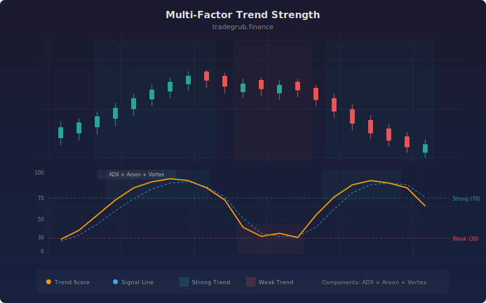

# Multi-Factor Trend Strength

The Multi-Factor Trend Strength indicator combines three independent trend measurement systems, ADX, Aroon, and Vortex Indicator, into a single normalized score from 0 to 100. Each component captures a different aspect of trend behavior: directional strength, recency of extremes, and positive/negative movement flow. By averaging their normalized outputs, the composite provides a more robust and less noisy trend conviction reading than any single indicator can deliver.

## Conceptual Diagram



## How It Works

The indicator computes three independent trend measurements. ADX (Average Directional Index, default 14-period) quantifies trend strength on a 0-50+ scale regardless of direction. Aroon (default 25-period) measures the recency of the highest high and lowest low, producing up and down components. Vortex Indicator (default 14-period) compares positive and negative trend movement by analyzing the relationship between current highs/lows and previous lows/highs.

Each component is normalized to a 0-100 scale using its natural output range. ADX is normalized by dividing by 50 and multiplying by 100, mapping its typical 0-50 range to 0-100. Aroon's directional difference (up minus down, ranging from -100 to +100) is shifted and scaled to 0-100. Vortex's directional difference (VI+ minus VI-, ranging roughly from -1 to +1) is similarly shifted and scaled.

The three normalized values are averaged to produce the composite trend strength score. A 5-period SMA of the score serves as a signal line. Readings above the strong trend threshold (default 70) indicate that all three components agree on strong directional movement, highlighted with green background. Readings below 30 (100 minus the threshold) indicate weak or absent trend conditions, highlighted with red background.

The signal line crossover provides timing: when the raw score crosses above the signal line from below, trend momentum is accelerating. When it crosses below from above, momentum is decelerating. These crossovers within the context of the absolute score level provide both direction and timing information.

## Parameters

| Parameter | Default | Range | Description |
|-----------|---------|-------|-------------|
| ADX Length | 14 | 5 - 50 | Lookback period for ADX calculation |
| Aroon Length | 25 | 10 - 50 | Lookback period for Aroon indicator |
| Vortex Length | 14 | 5 - 50 | Lookback period for Vortex Indicator |
| Strong Trend | 70 | 50 - 90 | Threshold above which the trend is classified as strong |

## Python Advantage

The multi-indicator normalization and composite scoring leverage Python's ability to perform arithmetic on arrays returned from different indicator functions, combining them in a single expression:

```python
# Three independent trend indicators — each returns full arrays
adx_val = ta.adx(high, low, close, adx_len, adx_len)
aroon_up, aroon_down = ta.aroon(high, low, aroon_len)
vi_plus, vi_minus = ta.vi(high, low, close, vi_len)

# Vectorized normalization to common 0-100 scale
adx_norm = adx_val / 50 * 100
aroon_norm = (aroon_up - aroon_down + 100) / 2
vi_norm = (vi_plus - vi_minus + 1) / 2 * 100

# Composite score: average of three normalized components
score = (adx_norm + aroon_norm + vi_norm) / 3
```

The tuple unpacking (`aroon_up, aroon_down = ta.aroon(...)`) and subsequent array arithmetic operates on the entire history simultaneously. In Pine, each of these would require separate variable declarations and the normalization math would execute bar-by-bar. Python makes it trivial to add a fourth component (e.g., `supertrend_norm`) by simply including it in the average and changing the divisor to 4.

## When to Use

The Trend Strength indicator works on all timeframes and asset classes. It is most valuable as a trade filter on daily and 4-hour charts: only take trend-following entries when the score is above the strong trend threshold, and switch to range-bound strategies when the score is below 30. Declining scores from high levels warn of trend exhaustion before the trend visually breaks down on the price chart.

## Risk Management

High trend strength scores do not indicate direction, only conviction. Always pair with a directional indicator (MA Cloud, EMA Ribbon) to determine which side to trade. When the score drops below 50, trail stops aggressively as trend support is weakening. Avoid initiating new trend-following positions when the score is falling, even if it is still above the strong trend threshold, as the deceleration often precedes a reversal.

## Combining with Other Indicators

- **MA Crossover Signal**: Only act on crossover signals when the Trend Strength score confirms a strong trending environment, filtering out whipsaws during weak-trend periods.
- **Heikin-Ashi Candles**: Use Trend Strength to validate that consecutive same-color Heikin-Ashi candles reflect genuine trend conviction rather than low-volatility drift.
- **Market Regime**: Cross-reference the Trend Strength score with the Market Regime detector for a multi-dimensional view of whether the market is trending strongly, trending weakly, or ranging.
