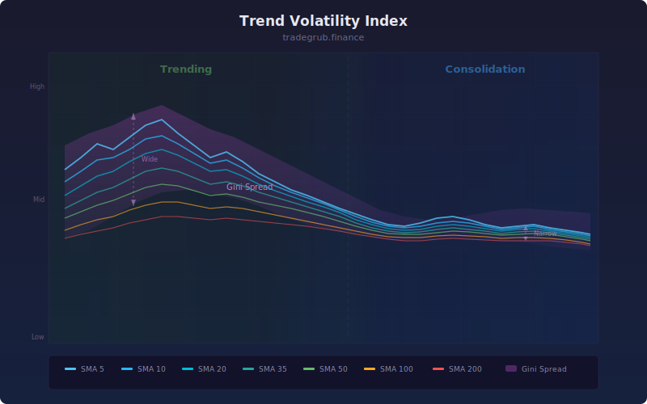

# Trend Volatility Index

Measures trend strength by computing the Gini mean difference across multiple simple moving averages. When MAs are spread apart the market is trending; when tangled together it is consolidating.

## Conceptual Diagram

## Parameters

| Parameter | Type | Default | Range | Description |
|-----------|------|---------|-------|-------------|
| Base Length | int | 5 | 2-20 | Shortest SMA period (others are 2x, 4x, 8x multiples) |

## Signals

- Above 75: strong trend (MAs well-separated)
- Below 25: consolidation (MAs converging)
- Rising TVI: trend developing
- Falling TVI: trend weakening

## Usage

Use TVI to filter trend-following strategies. Enter trend trades only when TVI is above 50. Avoid trend strategies when TVI is below 25. The percentile-rank normalization ensures the 0-100 scale adapts to each instrument's typical behavior.
