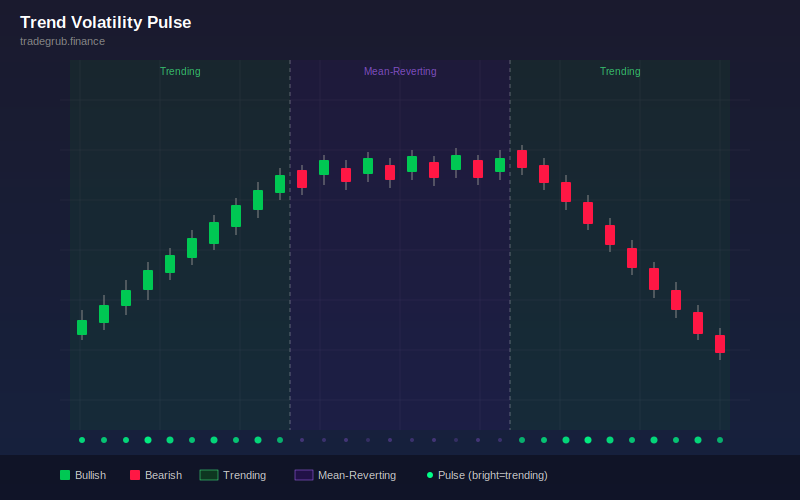

# Trend Volatility Pulse

Composite trend and volatility indicator that pulses between trending and mean-reverting regimes using multi-factor momentum and volatility analysis via numpy. This trend-following indicator provides quantitative signals that can be applied to any liquid market across all timeframes.

## Conceptual Diagram



## How It Works

The indicator analyzes price data using trend-following techniques to produce actionable signals.

Built-in technical functions used: `atr, ema, sma`. These provide the foundation for the indicator's calculations, computed efficiently across the full price history in a single pass.

Core techniques include exponential moving average, simple moving average, ATR, iterative computation. The computation processes all bars simultaneously using vectorized numpy operations, ensuring consistent results regardless of the dataset size.

Integer parameters control window lengths and thresholds, allowing the indicator to adapt from scalping on short timeframes to position trading on weekly charts. Shorter windows increase sensitivity to recent price action while longer windows provide smoother, more reliable signals.

## Parameters

| Parameter | Default | Range | Description |
|-----------|---------|-------|-------------|
| Fast Length | 8 | 3 - 20 | Controls fast length sensitivity (int) |
| Slow Length | 21 | 10 - 60 | Controls slow length sensitivity (int) |
| Volatility Length | 14 | 5 - 30 | Controls volatility length sensitivity (int) |

## Signals

- **Trend Pulse**: Primary visual output plotted as a continuous line on the chart
- **Vol Component**: Primary visual output plotted as a continuous line on the chart
- **Strong Bull** (30): Reference level for threshold-based decisions
- **Strong Bear** (-30): Reference level for threshold-based decisions
- **Neutral** (0): Reference level for threshold-based decisions
- **Background shading**: Highlights active signal zones based on (smoothed > 30).tolist()
- **Background shading**: Highlights active signal zones based on (smoothed < -30).tolist()
- **Background shading**: Highlights active signal zones based on vol_spike.tolist()

## Python Advantage

The entire computation runs as vectorized numpy operations, processing all bars simultaneously rather than one at a time:

```python
fast_ema = np.array(ta.ema(close, fast_len), dtype=float)
slow_ema = np.array(ta.ema(close, slow_len), dtype=float)
fast_ema = np.nan_to_num(fast_ema, nan=0.0)
slow_ema = np.nan_to_num(slow_ema, nan=0.0)

atr_arr = np.array(ta.atr(high, low, close, vol_len), dtype=float)
atr_arr = np.nan_to_num(atr_arr, nan=1.0)

trend_component = np.zeros(n)
for i in range(slow_len, n):
```

Python's numpy arrays allow element-wise arithmetic across thousands of bars in a single expression. Adding custom variations or combining with other calculations is straightforward, requiring only standard array operations.

## When to Use

- Identify the dominant trend direction before entering positions
- Filter out counter-trend signals from other indicators
- Time entries during trend pullbacks to moving average or trend line support
- Set trailing stops that follow the trend progression

Works best on daily and intraday charts for liquid instruments. Shorter parameter values suit scalping and day trading while longer values work for swing and position trading.

## Risk Management

No indicator is predictive on its own. Always define risk before entering a trade:

- Set stop-losses based on ATR or recent swing points, not arbitrary percentages
- Size positions so that a stop-loss hit risks no more than 1-2% of account equity
- Avoid adding to losing positions based solely on indicator readings
- Backtest parameter combinations on out-of-sample data before live trading

## Combining with Other Indicators

- **Volume Profile POC**: When this indicator's signal aligns with a high-volume node from the Volume Profile, the confluence creates a stronger setup with better follow-through.
- **RSI or Stochastic**: Add a momentum oscillator as a confirmation filter. Signals that align with oversold or overbought momentum readings tend to produce larger moves.
- **ATR-Based Stops**: Use ATR to set stop-losses that respect current volatility. Tighter stops in low-volatility environments and wider stops during volatile periods improve the reward-to-risk ratio.
