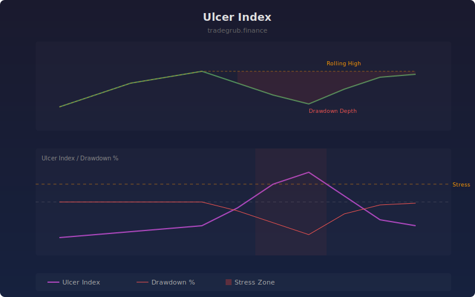

# Ulcer Index

The Ulcer Index measures downside risk by capturing both the depth and duration of price drawdowns from recent highs. Unlike standard deviation which treats upside and downside moves equally, the Ulcer Index focuses exclusively on the pain of drawdowns, making it a more intuitive risk measure for investors.

## How It Works

- Tracks the rolling maximum price over the lookback window
- Calculates percentage drawdown from the rolling high at each bar
- Computes the root mean square of drawdown percentages over the window
- Higher values indicate deeper or more prolonged drawdowns
- Optionally displays the raw drawdown percentage alongside the index

## Parameters

| Parameter | Default | Range | Description |
|-----------|---------|-------|-------------|
| Length | 14 | 5-100 | Rolling window for calculation |
| Show Drawdown % | true | - | Display raw percentage drawdown line |

## Outputs

- **Ulcer Index**: RMS of drawdowns (purple line)
- **Drawdown %**: Current percentage below rolling high (red line)
- **Background**: Red shading during high stress periods

## Usage Notes

- Values near zero indicate a steady uptrend with minimal pullbacks
- Rising Ulcer Index values warn of increasing drawdown risk
- Compare across different assets to identify which carries more downside risk
