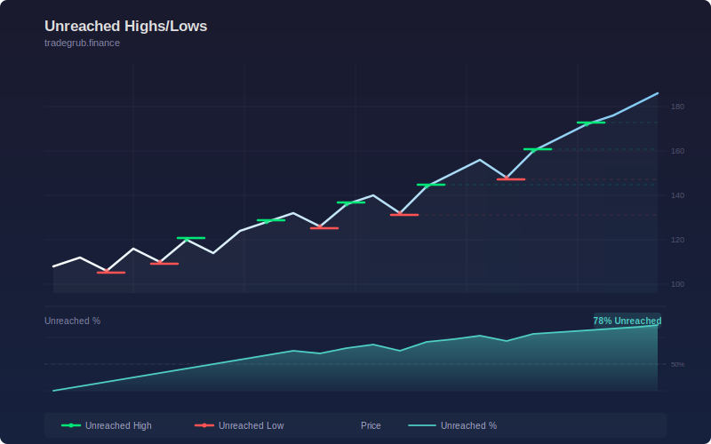

# Unreached Highs/Lows Oscillator

Measures the percentage of recent candle highs and lows that have not been revisited by subsequent price action. A high percentage of unreached highs during an uptrend signals strong, persistent momentum. When price begins revisiting old highs, the trend is weakening.

## Conceptual Diagram

## Parameters

- **Lookback Period:** Number of recent bars to analyze (default 30, range 5 to 100)

## Signals

- **Unreached Highs % rising above 50:** Strong uptrend persistence, price is not pulling back to prior highs
- **Unreached Lows % rising above 50:** Strong downtrend persistence, price is not bouncing back to prior lows
- **Net Persistence positive (green background):** Uptrend dominance
- **Net Persistence negative (red background):** Downtrend dominance
- **Declining unreached percentages:** Trend weakening, price revisiting more levels

## How It Works

For each bar in the lookback window, the indicator checks whether subsequent price action revisited that bar's high or low:

1. A high is "unreached" if no subsequent bar's low dipped below that high level
2. A low is "unreached" if no subsequent bar's high rose above that low level
3. Unreached Highs % = count of unreached highs / lookback period x 100
4. Unreached Lows % = count of unreached lows / lookback period x 100
5. Net Persistence = Unreached Highs % minus Unreached Lows %

The oscillator plots all three values. Background shading appears when net persistence exceeds +/- 30, highlighting strong directional bias.
