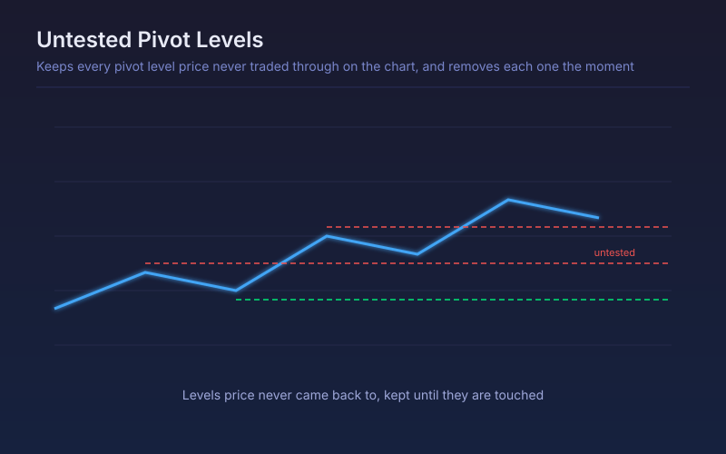

# Untested Pivot Levels

Keeps every pivot level price never traded through on the chart, and removes each one the moment it is finally touched.

## Conceptual Diagram

## Parameters

| Parameter | Default | Range | Description |
|-----------|---------|-------|-------------|
| Pivot period (bars per group) | 1 | 1-100 | Bars per group; larger groups produce fewer, more significant levels |
| Maximum levels kept | 12 | 1-60 | How many untested levels stay on the chart |
| Line length (bars) | 60 | 5-500 | How far each level is drawn forward from where it formed |
| Label each level | True | true/false | Draw the untested label beside each line |

## Signals

- A cluster of untested levels overhead: price has a lot of unvisited territory above it
- The nearest untested level in each direction, plotted as its own series for alerting
- A level disappearing between refreshes: price finally traded through it, so it is no longer untested
- No untested levels nearby: price has already retested its recent structure

## Usage

Use as a map of where price has not been rather than where it reversed. Untested levels tend to act as magnets in ranging markets and as clean measured targets in trends, and the count itself is a rough measure of how much unfinished business sits above or below.
