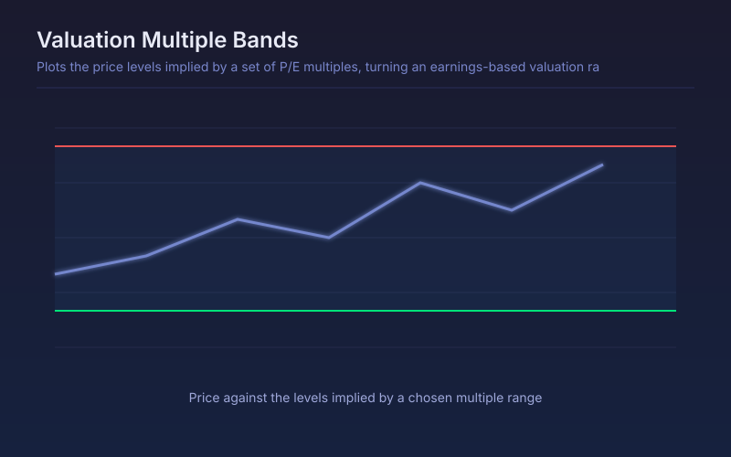

# Valuation Multiple Bands

Plots the price levels implied by a set of P/E multiples, turning an earnings-based valuation range into bands drawn directly on the chart.

## Conceptual Diagram

## Parameters

| Parameter | Default | Range | Description |
|-----------|---------|-------|-------------|
| Reporting period | FY | FY or FQ | Annual or quarterly earnings used for EPS |
| Low multiple | 10.0 | 1-100 | Multiple defining the lower band |
| Mid multiple | 18.0 | 1-100 | Multiple defining the reference band |
| High multiple | 26.0 | 1-200 | Multiple defining the upper band |

## Signals

- Price at the low band: trading at the cheap end of the chosen multiple range
- Price at the high band: priced for the optimistic end of the range
- Bands stepping at a filing: earnings changed, so the whole valuation range reprices
- No bands at all: earnings are not positive, and a P/E band cannot be drawn

## Usage

Set the multiples from the company's own history or its peer group rather than using the defaults as gospel; the point is to see where price sits inside a range you chose deliberately. Works on profitable, established businesses and says nothing useful about pre-earnings growth names.

## Data Requirements

This script reads filed financial statements through `request.financial()`, so it
needs fundamental data for the charted symbol. On instruments without filed
statements, such as crypto pairs, forex and most indices, the series is empty and
nothing plots. Values step only at each filing date and stay flat in between.
