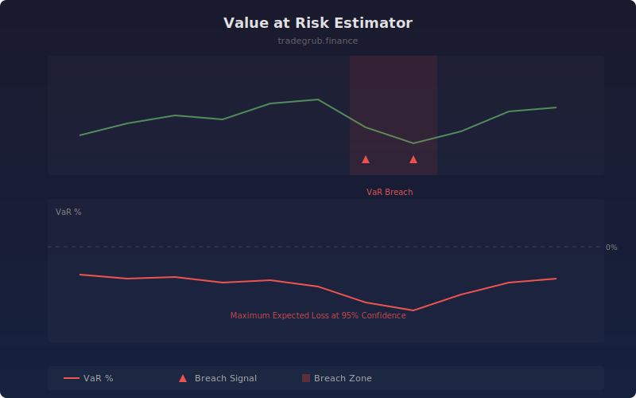

# Value at Risk Estimator

The Value at Risk Estimator calculates the maximum expected loss at a given confidence level over the lookback period. It supports both parametric (assuming normal distribution) and historical simulation methods, providing a quantitative risk boundary for position sizing and risk management.

## How It Works

- Computes log returns over the specified lookback window
- Parametric method: uses mean and standard deviation with z-score for the confidence level
- Historical method: directly sorts returns and picks the percentile cutoff
- Displays VaR as a percentage of current price
- Flags bars where actual returns breach the prior VaR estimate

## Parameters

| Parameter | Default | Range | Description |
|-----------|---------|-------|-------------|
| Lookback Length | 60 | 20-500 | Number of bars for return distribution |
| Confidence % | 95.0 | 90.0-99.9 | Confidence level for VaR calculation |
| Method | 0 | 0-1 | 0 for parametric, 1 for historical simulation |

## Outputs

- **VaR %**: Estimated maximum loss as percentage (red line)
- **VaR Breach**: Triangle markers when actual loss exceeds VaR
- **Background**: Red shading on breach bars

## Usage Notes

- More negative VaR values indicate higher estimated risk
- Frequent VaR breaches suggest the model is underestimating true risk
- Use historical method for assets with fat-tailed return distributions
