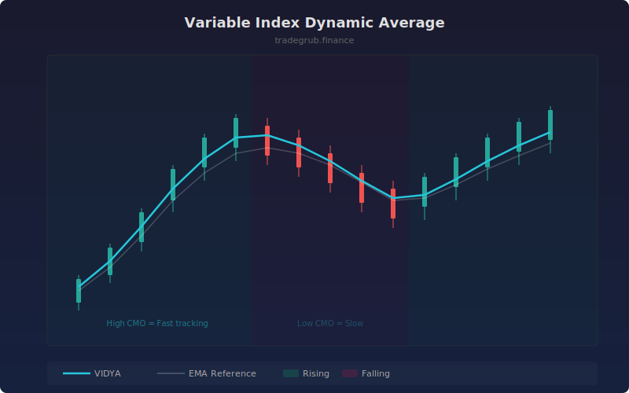

# Variable Index Dynamic Average

Adaptive moving average that adjusts its smoothing speed using the Chande Momentum Oscillator ratio. When momentum is strong, VIDYA tracks price closely. When momentum weakens, it smooths more aggressively to avoid whipsaws.

## How It Works

- Calculates the Chande Momentum Oscillator (CMO) over a configurable period
- Uses the absolute CMO value as a scaling factor for the EMA smoothing constant
- High CMO (strong directional movement) produces faster adaptation
- Low CMO (choppy/sideways market) produces slower, more filtered output
- The result adapts continuously to changing market conditions

## Parameters

| Parameter | Default | Range | Description |
|-----------|---------|-------|-------------|
| Length | 14 | 2-100 | Base EMA smoothing period |
| CMO Length | 9 | 2-50 | Chande Momentum Oscillator lookback |

## Outputs

- **VIDYA (cyan)**: The variable index dynamic average
- **EMA Reference (faint white)**: Standard EMA for comparison
- **Background**: Green tint for rising, red tint for falling

## Usage Notes

- VIDYA responds faster than a standard EMA during strong trends and slower during consolidation
- Shorter CMO lengths make the adaptation more reactive to recent momentum changes
- Useful as a trend filter: price above rising VIDYA is bullish, below falling VIDYA is bearish
