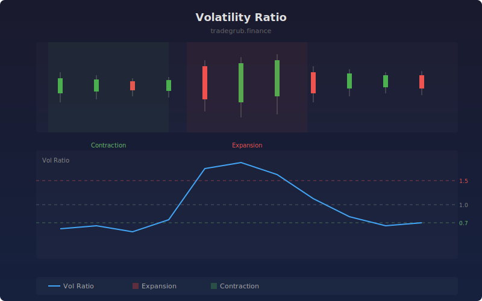

# Volatility Ratio

The Volatility Ratio compares short-term volatility to long-term volatility, providing a normalized measure of whether the market is in an expansion or contraction phase. Values above 1.0 indicate elevated short-term activity relative to the longer trend, while values below 1.0 suggest consolidation.

## How It Works

- Calculates log returns from close prices
- Computes rolling standard deviation over short and long windows
- Divides short-term volatility by long-term volatility to produce the ratio
- Values above the expansion threshold signal volatility breakouts
- Values below the contraction threshold signal squeeze conditions

## Parameters

| Parameter | Default | Range | Description |
|-----------|---------|-------|-------------|
| Short Length | 5 | 2-50 | Short-term volatility window |
| Long Length | 20 | 10-200 | Long-term volatility window |
| Expansion Threshold | 1.5 | 1.0-5.0 | Level above which volatility is expanding |
| Contraction Threshold | 0.7 | 0.1-1.0 | Level below which volatility is contracting |

## Outputs

- **Vol Ratio**: Ratio of short to long volatility (blue line)
- **Background**: Red for expansion zones, green for contraction zones

## Usage Notes

- Contraction zones often precede significant price moves in either direction
- Expansion spikes can confirm breakout validity when combined with price action
- The neutral line at 1.0 represents equilibrium between short and long volatility
