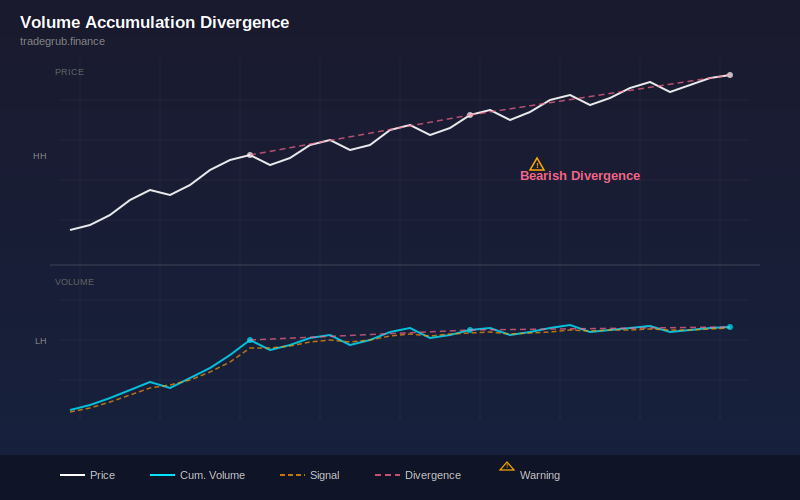

# Volume Accumulation Divergence

Modified on-balance volume with smoothing and signal line for detecting volume-price divergences that precede trend reversals using numpy. This volume-based indicator provides quantitative signals that can be applied to any liquid market across all timeframes.

## Conceptual Diagram



## How It Works

The indicator analyzes price data using volume-based techniques to produce actionable signals.

Built-in technical functions used: `ema`. These provide the foundation for the indicator's calculations, computed efficiently across the full price history in a single pass.

Core techniques include exponential moving average, simple moving average, iterative computation, standard deviation analysis. The computation processes all bars simultaneously using vectorized numpy operations, ensuring consistent results regardless of the dataset size.

Integer parameters control window lengths and thresholds, allowing the indicator to adapt from scalping on short timeframes to position trading on weekly charts. Shorter windows increase sensitivity to recent price action while longer windows provide smoother, more reliable signals.

## Parameters

| Parameter | Default | Range | Description |
|-----------|---------|-------|-------------|
| OBV Smoothing | 10 | 3 - 30 | Controls obv smoothing sensitivity (int) |
| Signal Length | 5 | 2 - 15 | Controls signal length sensitivity (int) |
| Divergence Lookback | 20 | 10 - 50 | Controls divergence lookback sensitivity (int) |

## Signals

- **Smoothed OBV**: Primary visual output plotted as a continuous line on the chart
- **Bull Div**: Discrete signal marker displayed at key points
- **Bear Div**: Discrete signal marker displayed at key points
- **Zero** (0): Reference level for threshold-based decisions
- **Strong Acc** (2): Reference level for threshold-based decisions
- **Strong Dist** (-2): Reference level for threshold-based decisions
- **Background shading**: Highlights active signal zones based on bull_div.tolist()
- **Background shading**: Highlights active signal zones based on bear_div.tolist()

## Python Advantage

The entire computation runs as vectorized numpy operations, processing all bars simultaneously rather than one at a time:

```python
obv = np.zeros(n)
for i in range(1, n):
    if cl[i] > cl[i-1]:
        obv[i] = obv[i-1] + vol[i]
    elif cl[i] < cl[i-1]:
        obv[i] = obv[i-1] - vol[i]
    else:
        obv[i] = obv[i-1]

obv_smooth = np.array(ta.ema(obv.tolist(), smooth_len), dtype=float)
```

Python's numpy arrays allow element-wise arithmetic across thousands of bars in a single expression. Adding custom variations or combining with other calculations is straightforward, requiring only standard array operations.

## When to Use

- Confirm price moves with volume participation
- Identify accumulation and distribution phases
- Detect institutional activity through volume anomalies
- Filter false breakouts that lack volume confirmation

Works best on daily and intraday charts for liquid instruments. Shorter parameter values suit scalping and day trading while longer values work for swing and position trading.

## Risk Management

No indicator is predictive on its own. Always define risk before entering a trade:

- Set stop-losses based on ATR or recent swing points, not arbitrary percentages
- Size positions so that a stop-loss hit risks no more than 1-2% of account equity
- Avoid adding to losing positions based solely on indicator readings
- Backtest parameter combinations on out-of-sample data before live trading

## Combining with Other Indicators

- **Moving Average Ribbon**: Use the Moving Average Ribbon to confirm the overall trend direction before acting on this indicator's signals. Trading in the direction of the ribbon produces higher win rates.
- **RSI or Stochastic**: Add a momentum oscillator as a confirmation filter. Signals that align with oversold or overbought momentum readings tend to produce larger moves.
- **ATR-Based Stops**: Use ATR to set stop-losses that respect current volatility. Tighter stops in low-volatility environments and wider stops during volatile periods improve the reward-to-risk ratio.
