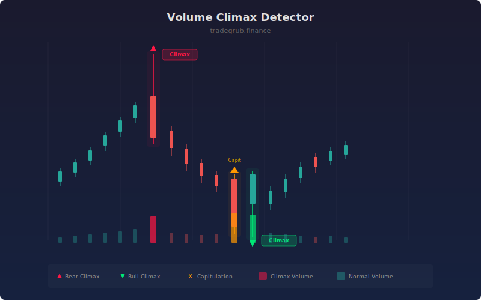

# Volume Climax Detector

Identifies extreme volume bars at potential reversal points, distinguishing between exhaustion climaxes (large wicks showing rejection) and capitulation events (large bodies showing full surrender). These patterns often mark turning points where one side of the market is overwhelmed.

## How It Works

- Computes a volume moving average and flags bars where volume exceeds it by a high multiplier (default 3x).
- Analyzes candle structure: large upper wick with climax volume signals bearish exhaustion, large lower wick signals bullish exhaustion.
- Identifies capitulation as climax volume bars with very large bodies (70%+ body ratio), indicating full directional surrender.
- Marks each pattern type with distinct shapes and background shading.
- Labels are spaced with a cooldown to prevent visual clutter.

## Parameters

| Parameter | Default | Range | Description |
|-----------|---------|-------|-------------|
| Volume MA Length | 20 | 5-100 | Lookback for the volume moving average |
| Climax Multiplier | 3.0 | 1.5-10.0 | Volume must exceed its MA by this factor |
| Min Wick Ratio | 0.5 | 0.2-0.9 | Minimum wick-to-range ratio for exhaustion classification |
| Show Labels | true | on/off | Display labels on climax bars |

## Outputs

- **Bear Climax**: Red triangle above bar on bearish exhaustion
- **Bull Climax**: Green triangle below bar on bullish exhaustion
- **Sell Capitulation**: Orange X-cross above bar on panic selling
- **Buy Capitulation**: Gold X-cross below bar on panic buying

## Usage Notes

- Exhaustion climaxes (large wicks) are stronger reversal signals than capitulation (large bodies).
- Look for climax signals near key support/resistance levels for higher-probability reversals.
- A climax bar followed by a displacement in the opposite direction strongly confirms the reversal.
