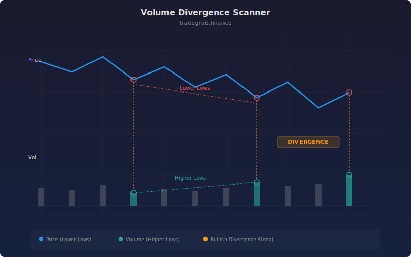

# Volume Divergence Scanner

Detects bullish and bearish divergences between price action and volume using swing point analysis. Divergences occur when price and volume move in opposite directions at swing points, often signaling potential reversals.

## Conceptual Diagram

## Parameters

| Parameter | Type | Default | Description |
|-----------|------|---------|-------------|
| Swing Lookback | int | 5 | Number of bars on each side to confirm a swing high or low |
| Min Bars Between Swings | int | 10 | Minimum bar distance between consecutive swing points |
| Show Labels | bool | True | Display divergence labels on the chart |

## Signals

**Bullish Divergence**: Price makes a lower low while volume makes a higher low at the corresponding swing point. This suggests selling pressure is weakening despite lower prices.

**Bearish Divergence**: Price makes a higher high while volume makes a lower high at the corresponding swing point. This suggests buying pressure is weakening despite higher prices.

**Divergence Strength Line**: A normalized score that spikes at each detected divergence and decays over time. Positive values indicate bullish divergence strength, negative values indicate bearish.

## Use Cases

- Spot potential trend reversals before they happen by watching for divergence signals
- Filter trade entries by requiring divergence confirmation alongside other indicators
- Gauge the conviction behind a price move by checking whether volume supports it
- Combine with support and resistance levels to identify high-probability reversal zones
