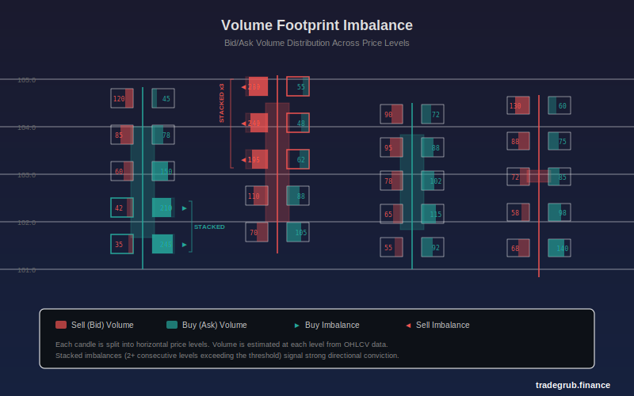

# Volume Footprint Imbalance

Estimates bid/ask volume imbalance within each candle by analyzing price position, wick structure, and bar direction. This indicator approximates order flow footprint data from standard OHLCV bars, giving traders insight into buyer/seller dominance at different price levels without requiring tick-level data.

## Conceptual Diagram



## How It Works

The indicator reconstructs an approximate footprint profile for each candle using three steps:

**Zone Splitting:** Each bar's high-low range is divided into a configurable number of horizontal price levels (zones). The total bar volume is distributed across these zones.

**Volume Estimation:** At each zone, the indicator estimates how much volume came from buyers vs. sellers based on:
- **Close position:** Zones near the close receive more volume in the dominant direction
- **Wick ratios:** Upper wick zones are weighted toward selling (price rejection), lower wick zones toward buying (absorption)
- **Bar direction:** Bullish bars shift the buy/sell split in favor of buyers within the body, and vice versa

**Imbalance Calculation:** For each zone, a buy/sell ratio is computed. When this ratio exceeds the threshold, the zone is flagged as imbalanced. When two or more consecutive zones are imbalanced in the same direction, a "stacked imbalance" is detected, which is a stronger signal.

## Parameters

| Parameter | Default | Range | Description |
|-----------|---------|-------|-------------|
| Price Levels | 5 | 3 to 10 | Number of zones each candle is split into |
| Imbalance Threshold | 2.0 | 1.5 to 5.0 | Ratio required to flag a zone as imbalanced |
| Smoothing | 3 | 1 to 10 | EMA period applied to the net imbalance line |

## Signals

**Stacked Imbalances:** When multiple consecutive price levels within a candle show a buy or sell imbalance above the threshold, it suggests strong institutional activity at those prices. Stacked buy imbalances often precede upward moves, and stacked sell imbalances often precede downward moves.

**Divergences:** When price makes a new high but the net imbalance oscillator makes a lower high, it suggests buying pressure is weakening. The reverse applies for bearish divergences.

**Extreme Readings:** Net imbalance values above +0.3 or below -0.3 indicate strong directional conviction within the bar structure. These extremes can mark potential exhaustion points when they occur at the end of extended moves.

**Histogram Momentum:** The histogram color shifts between bright and dim shades. Bright green (increasing positive imbalance) shows accelerating buy pressure. Bright red (increasing negative imbalance) shows accelerating sell pressure. Dimming colors suggest momentum is fading.

## Python Advantage

Python enables complex per-bar, per-zone analysis that would be difficult in Pine Script:

```python
for z in range(num_levels):
    zone_mid = low[i] + z * zone_size + zone_size * 0.5
    proximity_to_close = 1.0 - abs(zone_pos - close_pos)
    # Wick-based sell bias shifts volume distribution
    if zone_high > body_top and upper_wick > 0:
        sell_bias = 0.6 + 0.2 * ((zone_mid - body_top) / upper_wick)
```

The nested loop over price levels within each bar, combined with NumPy for smoothing and array operations, allows a level of granularity that standard scripting languages cannot easily replicate.

## When to Use

This indicator works best on:
- **Intraday timeframes** (1-minute to 15-minute) where volume patterns carry the most information
- **Liquid instruments** (major stocks, ETFs, futures) where volume reflects genuine supply and demand
- **Trend confirmation** to validate whether a breakout has volume support at multiple price levels
- **Reversal detection** by spotting stacked imbalances against the prevailing trend

It is less effective on:
- Daily or weekly charts where intrabar volume distribution becomes too abstract
- Thinly traded instruments where volume data is sparse

## Risk Management

- Stacked imbalances are probabilistic signals, not guarantees. Always confirm with price action.
- High threshold values (4.0+) produce fewer but more reliable signals. Lower values (1.5 to 2.0) are more sensitive but noisier.
- Use the smoothed net imbalance line for trend direction and the histogram for timing entries.
- Consider position sizing based on the stacked imbalance count: higher counts suggest stronger conviction.

## Combining With Other Indicators

- **VWAP:** Use VWAP as a directional filter. Only take buy signals when price is above VWAP and sell signals when below.
- **Volume Profile:** Combine with volume profile to confirm that imbalances occur at high-volume nodes (stronger signal) vs. low-volume nodes (potential traps).
- **RSI or Momentum Oscillators:** Look for confluence between stacked imbalances and oversold/overbought readings for higher-probability reversals.
- **Support/Resistance Levels:** Stacked imbalances at known support or resistance levels carry more weight than those occurring in the middle of a range.
