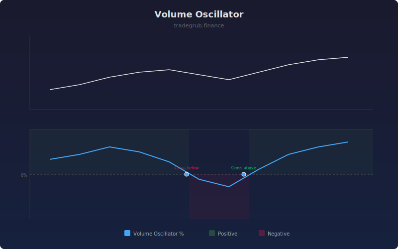

# Volume Oscillator

The Volume Oscillator measures the percentage difference between a fast and slow exponential moving average of volume. Positive values indicate rising participation and trend confirmation, while negative values suggest declining interest and potential trend exhaustion.

## How It Works

- Calculates a fast EMA of volume (default 5 periods) and a slow EMA (default 20 periods)
- Computes the percentage difference: (fast - slow) / slow * 100
- Positive readings mean short-term volume exceeds the longer-term average
- Negative readings mean recent volume is contracting relative to the trend
- Zero-line crossovers signal shifts in volume momentum

## Parameters

| Parameter | Default | Range | Description |
|-----------|---------|-------|-------------|
| Fast Length | 5 | 1-50 | Period for the fast volume EMA |
| Slow Length | 20 | 5-200 | Period for the slow volume EMA |
| Show Histogram | true | - | Display background color zones |

## Outputs

- **Volume Oscillator**: Percentage difference line oscillating around zero
- **Background**: Green tint for positive zone, red tint for negative zone

## Usage Notes

- Rising VO during a price uptrend confirms strong participation and trend health
- Falling VO during a price rally warns of declining interest and potential reversal
- Extreme positive spikes often accompany climax moves at trend tops or bottoms
