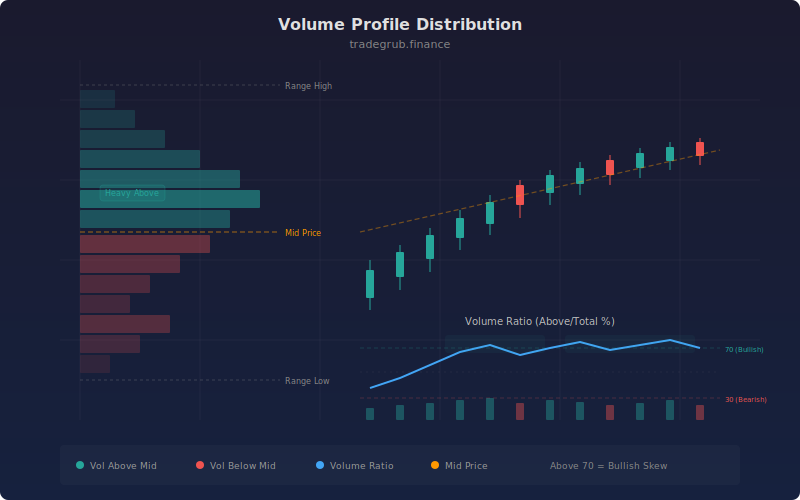

# Volume Profile Distribution

The Volume Profile Distribution indicator analyzes how trading volume is distributed relative to price levels, computing the ratio of volume traded above versus below the midpoint of the recent price range. This approach transforms raw volume data into a directional bias metric, revealing whether institutional participants are accumulating at higher prices (bullish) or distributing at lower prices (bearish) within the current range structure.

## Conceptual Diagram



## How It Works

The indicator first establishes the price range by computing the highest high and lowest low over the lookback period (default 50 bars). The midpoint of this range divides the price space into upper and lower halves. Volume is then classified based on where the close price falls relative to this midpoint.

Volume above the midpoint is accumulated using a weighted SMA: `ta.sma(volume * (close > mid_price), length)`. This creates a smoothed measure of volume that occurred when price was in the upper half of the range. The same logic is applied for volume below the midpoint. The boolean condition `close > mid_price` acts as a binary mask, zeroing out volume on bars where the condition is not met.

The volume ratio is computed as the proportion of above-midpoint volume to total volume, scaled to 0-100. A ratio above 70 means the majority of recent volume is concentrated in the upper half of the range, suggesting bullish accumulation at elevated prices. A ratio below 30 indicates volume concentration in the lower half, suggesting bearish distribution or capitulation.

Background highlighting draws attention to skewed distributions. Green shading appears when the ratio exceeds 70 (bullish volume skew), and red shading when it drops below 30 (bearish volume skew). The mid price, range high, and range low are plotted as overlays to provide price context for the volume distribution reading.

## Parameters

| Parameter | Default | Range | Description |
|-----------|---------|-------|-------------|
| Lookback Length | 50 | 20 - 200 | Period for range calculation and volume smoothing |
| Number of Levels | 10 | 5 - 20 | Granularity of price level divisions for analysis |

## Python Advantage

The volume distribution computation uses boolean array masking to conditionally weight volume, a pattern that operates across all bars in a single vectorized expression:

```python
import numpy as np

# Range and midpoint as vectorized array operations
hi = ta.highest(high, length)
lo = ta.lowest(low, length)
mid_price = (hi + lo) / 2

# Boolean masking for conditional volume accumulation
vol_above = ta.sma(volume * (close > mid_price), length)
vol_below = ta.sma(volume * (close < mid_price), length)

# Ratio with epsilon guard against division by zero
vol_ratio = vol_above / (vol_above + vol_below + 1e-10) * 100
```

The expression `volume * (close > mid_price)` multiplies the entire volume array by a boolean array, zeroing out volume on bars where price is below the midpoint. This conditional masking across full arrays is a distinctly Python/numpy pattern. The epsilon guard (`+ 1e-10`) prevents division-by-zero across all bars without any conditional branching. You could extend this to N-level distribution using `np.digitize(close, np.linspace(lo, hi, num_levels))` for granular price-level volume bucketing.

## When to Use

Volume Profile Distribution works best on liquid instruments where volume data is meaningful: equities, ETFs, and futures. Use it on daily charts for swing trading to identify accumulation and distribution zones. On intraday charts, it reveals session-level volume skew. It is less reliable on thinly traded assets or forex pairs where tick volume is a proxy for actual volume.

## Risk Management

Volume distribution is a confirming indicator, not a standalone entry signal. High volume ratios during uptrends confirm buying pressure, but do not guarantee continuation. When the ratio diverges from price direction (price rising but ratio falling), it warns of weakening conviction. Size positions based on the strength of the volume confirmation: full size when ratio aligns with trend, reduced size when it diverges.

## Combining with Other Indicators

- **Volume Profile POC**: Use the POC for specific price-level support/resistance and the Distribution ratio for overall directional volume bias within the range.
- **Correlation Indicator**: Cross-reference volume distribution skew with the Price-Volume Correlation to distinguish between volume-confirmed trends and volume-divergent moves.
- **Smart Money Concepts**: Validate Break of Structure signals with volume distribution: a BOS accompanied by a high volume ratio in the breakout direction has stronger institutional backing.
