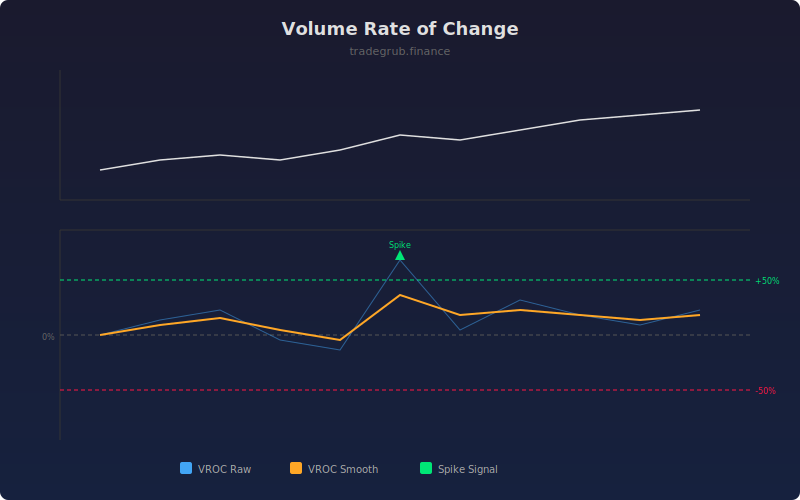

# Volume Rate of Change

The Volume Rate of Change (VROC) measures the percentage change in volume over a specified lookback period. It quantifies the acceleration or deceleration of market participation, helping identify volume surges that often precede significant price moves.

## How It Works

- Calculates the percentage change in volume compared to N bars ago
- Applies optional smoothing via SMA to reduce noise
- Positive values indicate volume is increasing versus the lookback period
- Extreme positive spikes signal sudden interest surges
- Threshold levels help identify statistically significant volume changes

## Parameters

| Parameter | Default | Range | Description |
|-----------|---------|-------|-------------|
| Length | 14 | 1-100 | Lookback period for rate of change calculation |
| Smoothing | 3 | 1-20 | SMA smoothing period for the VROC line |
| Upper Threshold % | 50.0 | 10-500 | Percentage threshold for volume spike detection |

## Outputs

- **VROC**: Raw volume rate of change percentage
- **VROC Smooth**: Smoothed version for cleaner signals
- **Volume Spike markers**: Green triangles when VROC exceeds the upper threshold

## Usage Notes

- Volume spikes often precede breakouts; watch for VROC exceeding the threshold near key levels
- Declining VROC during a trend warns that participation is fading
- Combine with price action to distinguish accumulation spikes from distribution spikes
