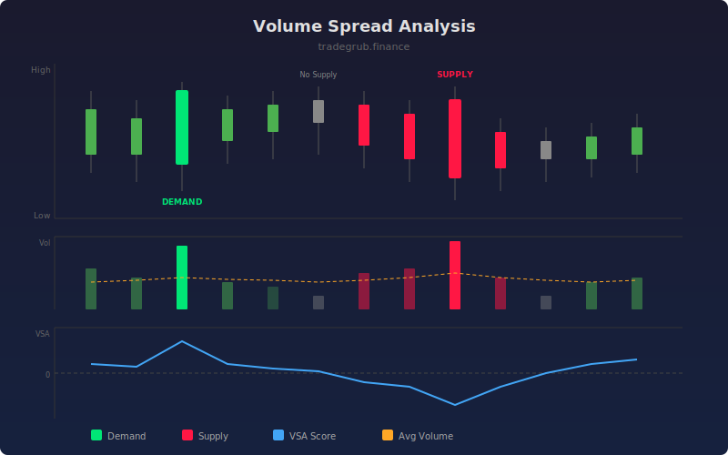

# Volume Spread Analysis

Volume Spread Analysis (VSA) examines the relationship between candle spread (high minus low) and volume to detect supply and demand imbalances. High volume with wide spreads on up-closes signals demand, while the same on down-closes signals supply. Low-volume narrow-spread bars reveal the absence of interest from either side.

## How It Works

- Calculates relative volume and relative spread by comparing each bar to its rolling average
- Identifies demand bars: high relative volume, wide spread, and bullish close
- Identifies supply bars: high relative volume, wide spread, and bearish close
- Detects "no demand" (low volume bearish) and "no supply" (low volume bullish) conditions
- Outputs a composite VSA score combining volume and spread ratios with directional bias

## Parameters

| Parameter | Default | Range | Description |
|-----------|---------|-------|-------------|
| Volume Average Length | 20 | 5-100 | Lookback for average volume calculation |
| Spread Average Length | 20 | 5-100 | Lookback for average spread calculation |
| High Volume Multiplier | 1.5 | 1.0-3.0 | Threshold for high relative volume |
| Low Volume Multiplier | 0.5 | 0.1-1.0 | Threshold for low relative volume |
| Show Signal Labels | true | - | Display demand/supply triangle markers |

## Outputs

- **VSA Score**: Composite score; positive values indicate demand, negative values indicate supply
- **Relative Volume**: Current volume divided by its moving average
- **Demand markers**: Green triangles at bottom for demand bars
- **Supply markers**: Red triangles at top for supply bars

## Usage Notes

- Look for clusters of demand signals near support levels to confirm accumulation
- Supply signals near resistance suggest distribution and potential reversal
- The VSA score crossing zero can act as a trend filter for other strategies
