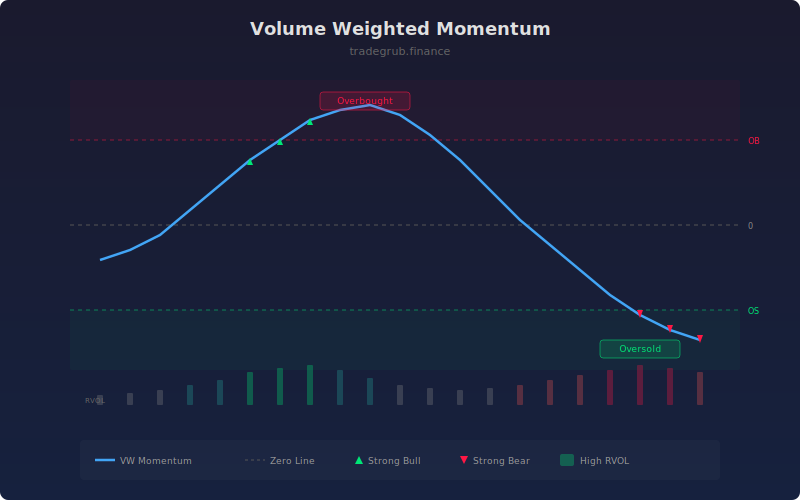

# Volume Weighted Momentum

Weights momentum signals by relative volume to filter out low-conviction price moves and highlight trends backed by strong participation. When momentum aligns with above-average volume, the signal carries more weight; when volume is thin, momentum readings are dampened.

## How It Works

- Calculates rate-of-change momentum over a configurable period.
- Computes relative volume as current volume divided by its moving average.
- Multiplies momentum by relative volume to produce the volume-weighted momentum oscillator.
- Applies optional smoothing and marks overbought/oversold thresholds.
- Flags high-conviction moves where both momentum and relative volume are elevated.

## Parameters

| Parameter | Default | Range | Description |
|-----------|---------|-------|-------------|
| Momentum Length | 14 | 2-50 | Rate-of-change lookback period |
| Volume MA Length | 20 | 5-100 | Lookback for the volume moving average |
| Smoothing | 3 | 1-10 | Smoothing applied to the output |
| Overbought | 1.5 | 0.5-5.0 | Upper threshold for overbought readings |
| Oversold | -1.5 | -5.0 to -0.5 | Lower threshold for oversold readings |

## Outputs

- **VW Momentum**: Main oscillator line (blue)
- **Zero Line**: Dashed horizontal reference
- **OB/OS Lines**: Overbought and oversold thresholds
- **Strong Bull/Bear**: Triangle markers when both momentum and volume confirm

## Usage Notes

- Signals above the overbought line with strong volume indicate powerful bullish momentum.
- Signals crossing zero with volume confirmation are more reliable trend change signals.
- Use the strong bull/bear markers as confirmation for entries identified by other methods.
