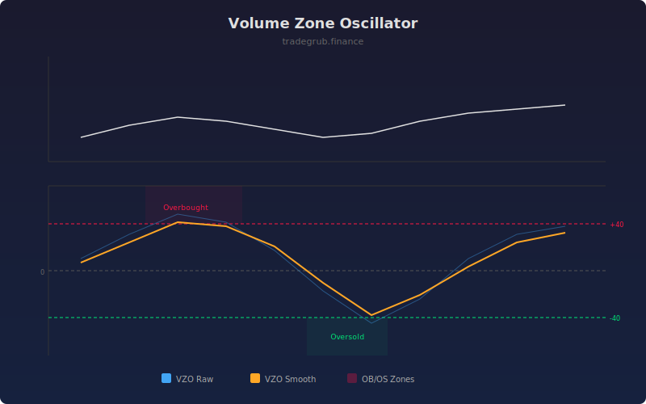

# Volume Zone Oscillator

The Volume Zone Oscillator (VZO) classifies each bar's volume as either up-volume or down-volume based on price direction, then computes a bounded oscillator showing the net balance. Readings above +40 suggest overbought conditions while readings below -40 suggest oversold conditions.

## How It Works

- Classifies each bar's volume as up-volume (price up) or down-volume (price down)
- Averages both up-volume and down-volume over the lookback period
- Computes the net percentage: (up - down) / total * 100
- Applies optional smoothing for cleaner signals
- Overbought and oversold thresholds identify extreme volume imbalances

## Parameters

| Parameter | Default | Range | Description |
|-----------|---------|-------|-------------|
| Length | 14 | 2-100 | Lookback period for volume zone averaging |
| Smoothing | 3 | 1-20 | SMA smoothing for the output line |
| Overbought | 40.0 | 10-80 | Upper threshold level |
| Oversold | -40.0 | -80 to -10 | Lower threshold level |

## Outputs

- **VZO Raw**: Unsmoothed volume zone oscillator
- **VZO**: Smoothed version for signal generation
- **Background**: Red tint in overbought zone, green tint in oversold zone

## Usage Notes

- VZO above +40 with divergence from price warns of potential distribution
- VZO below -40 during a downtrend can signal capitulation and a potential bottom
- Zero-line crossovers act as a simple volume-based trend filter
