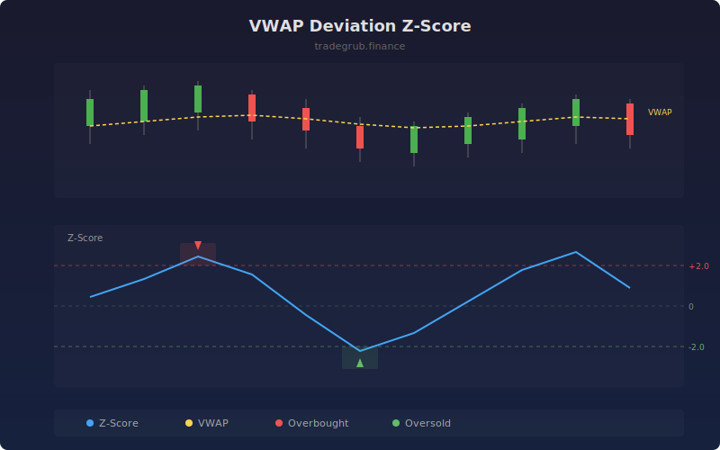

# VWAP Deviation Z-Score

Measures how far price has deviated from its Volume Weighted Average Price in standardized units. Extreme z-scores highlight overextended moves that are statistically likely to revert back toward the VWAP mean.

## How It Works

- Calculates a rolling VWAP using typical price weighted by volume over the lookback period
- Computes the raw deviation between current price and VWAP
- Standardizes the deviation into a z-score using rolling mean and standard deviation
- Flags overbought conditions when z-score exceeds the upper threshold and oversold when below the lower threshold
- Background shading and shape markers highlight extreme deviation zones

## Parameters

| Parameter | Default | Range | Description |
|-----------|---------|-------|-------------|
| VWAP Length | 50 | 10-200 | Rolling window for VWAP calculation |
| Z-Score Length | 20 | 5-100 | Window for z-score standardization |
| Upper Z Threshold | 2.0 | 0.5-4.0 | Overbought z-score level |
| Lower Z Threshold | -2.0 | -4.0 to -0.5 | Oversold z-score level |

## Outputs

- **VWAP Z-Score**: Main oscillator showing standardized deviation from VWAP
- **OB Signal**: Triangle markers when z-score exceeds upper threshold
- **OS Signal**: Triangle markers when z-score falls below lower threshold

## Usage Notes

- Best suited for intraday and short-term trading where VWAP acts as a magnet
- Extreme z-scores beyond 2.5 often precede sharp reversions to the mean
- Combine with volume analysis to confirm whether extension is supported by volume or likely to fade
