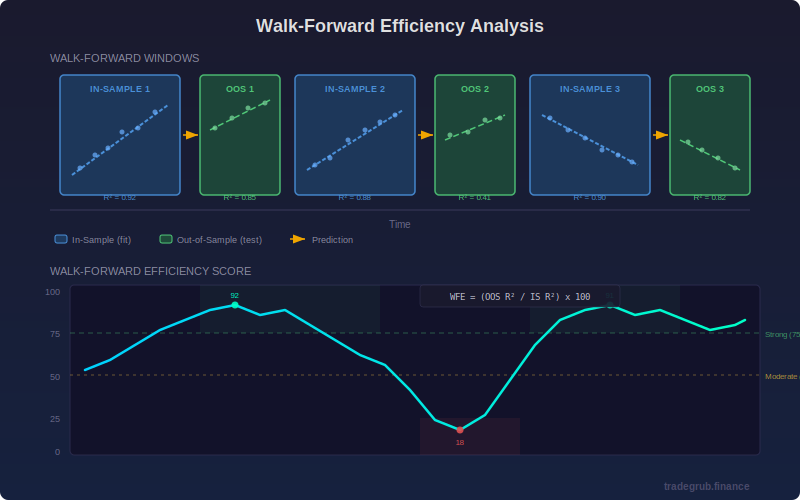

# Walk-Forward Efficiency

Measures how well in-sample trend characteristics hold up out-of-sample by comparing rolling regression fit quality across adjacent windows. This indicator helps traders identify whether observed price trends are robust or likely the result of overfitting to random noise.

## Conceptual Diagram



## How It Works

Walk-forward analysis is a technique borrowed from systematic trading research. The indicator divides recent price history into alternating segments:

1. **In-Sample Window:** A linear regression is fitted to this segment, capturing the dominant trend direction and strength. The R-squared value measures how well the line fits the data.

2. **Out-of-Sample Window:** The regression parameters (slope and intercept) from the in-sample fit are projected forward into this segment. A new R-squared is computed to measure how accurately the in-sample model predicts the out-of-sample data.

3. **Efficiency Ratio:** WFE = (Out-of-Sample R-squared / In-Sample R-squared) x 100, capped between 0 and 100. A high ratio means the trend persists beyond the fitting window. A low ratio means the apparent trend breaks down immediately.

4. **Multi-Window Averaging:** The process repeats across multiple overlapping walk-forward segments (controlled by the Number of Windows parameter). The final WFE value is the average efficiency across all windows, providing a more stable reading.

## Parameters

| Parameter | Default | Range | Description |
|-----------|---------|-------|-------------|
| In-Sample Length | 60 | 20-200 | Number of bars used to fit the regression model |
| Out-of-Sample Length | 20 | 10-100 | Number of bars used to test prediction quality |
| Number of Windows | 5 | 2-10 | How many walk-forward segments to average |

**Tip:** A common ratio is 3:1 for in-sample to out-of-sample length. Increasing the number of windows produces smoother readings but requires more historical data.

## Signals

- **WFE > 75 (Strong zone, green background):** The current trend characteristics are robust. Regression fits from recent in-sample windows continue to predict well out-of-sample. Trend-following strategies are more likely to work in this regime.

- **WFE 50-75 (Moderate zone):** Mixed persistence. Some trend characteristics hold, but reliability is inconsistent. Use additional confirmation before acting on trend signals.

- **WFE 25-50 (Weak zone):** Trend persistence is poor. In-sample patterns are not carrying forward reliably.

- **WFE < 25 (Overfitting risk, red background):** Apparent trends are breaking down out-of-sample. This is a warning sign that any trend-following signal may be unreliable. Mean-reversion strategies may be more appropriate in this regime.

- **Rising WFE crossing above 50:** A transition from noisy to trending behavior. Early signal that a sustained move may be developing.

- **Falling WFE crossing below 50:** A transition from trending to noisy behavior. Existing trend positions may be losing their edge.

## Python Advantage

The numpy-based regression computation enables efficient walk-forward analysis across multiple windows:

```python
def lin_reg_r2(y):
    x = np.arange(len(y), dtype=float)
    slope = np.sum((x - x.mean()) * (y - y.mean())) / np.sum((x - x.mean()) ** 2)
    intercept = y.mean() - slope * x.mean()
    y_pred = slope * x + intercept
    ss_res = np.sum((y - y_pred) ** 2)
    ss_tot = np.sum((y - y.mean()) ** 2)
    return max(0.0, 1.0 - ss_res / ss_tot)
```

This vectorized approach processes multiple regression windows per bar without performance degradation, something that would be impractical with loop-based scripting languages.

## When to Use

- **Before entering trend trades:** Check whether the current trend regime has genuine out-of-sample persistence, not just a good-looking in-sample fit.
- **Strategy regime detection:** Use WFE to switch between trend-following and mean-reversion approaches. High WFE favors trend strategies; low WFE favors reversion.
- **Backtest validation:** If WFE is consistently low on your trading timeframe, backtested trend strategies on that instrument may be overfit.
- **Timeframe selection:** Compare WFE across timeframes to find where trends are most persistent for a given instrument.

## Risk Management

- WFE is a statistical measure, not a directional signal. High WFE means trends persist, but does not indicate trend direction.
- Very short out-of-sample windows may produce noisy WFE readings. Use at least 15-20 bars for the out-of-sample length.
- WFE can remain low during legitimate consolidation periods. A low reading does not always indicate danger; it may simply reflect a range-bound market.
- The total lookback required is (in-sample + out-of-sample) x number of windows. Ensure your chart has enough history loaded.

## Combining With Other Indicators

- **With moving averages:** Use WFE to filter MA crossover signals. Only take crossover trades when WFE is above 50, confirming that trends are persisting.
- **With RSI or stochastics:** When WFE is low, oscillator-based mean-reversion signals become more relevant. When WFE is high, fade signals from oscillators may be premature.
- **With ATR:** Combine WFE for regime detection with ATR for position sizing. High WFE + expanding ATR is a strong trending environment.
- **With volume indicators:** Rising WFE accompanied by increasing volume adds conviction that the trend regime is supported by participation.
