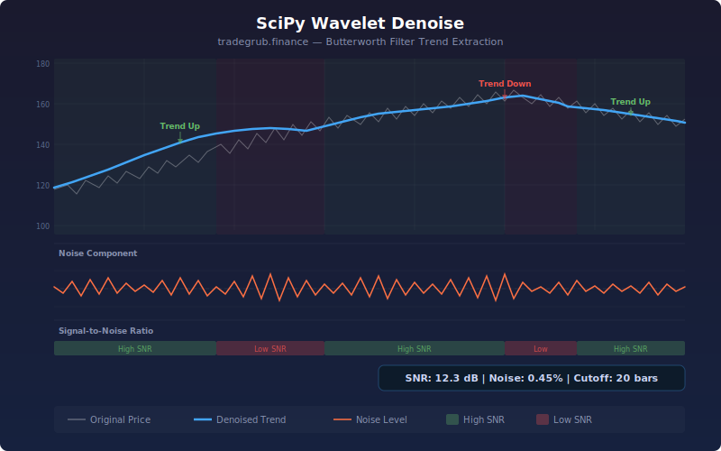

# Wavelet Denoise Filter

Applies scipy.signal Butterworth low-pass filtering to strip noise from price data, extracting a clean trend signal. The indicator plots the denoised trend alongside the original price and a noise level measurement, plus computes a rolling signal-to-noise ratio (SNR) to quantify how much of price movement is signal vs. noise.

## Conceptual Diagram



## How It Works

The indicator designs a Butterworth low-pass filter using scipy.signal.butter with a cutoff frequency derived from the user-configurable cutoff period. The filter passes through slow trend movements while attenuating high-frequency noise and chop. The signal is padded with mirrored data at both ends to reduce edge artifacts, then filtered using scipy.signal.sosfilt for numerical stability.

The noise component is simply the difference between the original price and the denoised trend. A rolling signal-to-noise ratio computes the ratio of trend variance to noise variance over a lookback window, expressed in decibels (dB). High SNR (above 10 dB) indicates price is dominated by trend. Low SNR (below 3 dB) indicates price is mostly noise with no clear direction.

Trend direction changes in the denoised signal mark pivot points where the underlying trend reverses, stripped of the noise that triggers false signals in raw price data.

## Parameters

| Parameter | Default | Range | Description |
| --------- | ------- | ----- | ----------- |
| Cutoff Period | 20 | 5-100 | Filter cutoff period in bars (longer = smoother) |
| Filter Order | 3 | 1-6 | Butterworth filter order (higher = sharper cutoff) |
| SNR Lookback | 14 | 5-50 | Window for signal-to-noise ratio calculation |
| Noise Smoothing | 5 | 1-20 | Moving average applied to noise level display |
| Show Labels | true | -- | Toggle trend reversal annotations |
| Show Levels | true | -- | Toggle SNR and noise statistics display |

## Outputs

- **Original Price (gray):** Raw price data for visual comparison
- **Denoised Trend (blue):** Clean trend signal with noise removed
- **Noise Level (orange):** Absolute noise magnitude (smoothed)
- **Background shading:** Green tint for high SNR, red tint for low SNR
- **Labels:** Trend direction changes annotated on the denoised line
- **Statistics:** Average SNR in dB, noise as percentage of price, cutoff period

## Python Advantage

Scipy provides IIR filter design and application that cannot be replicated in Pine:

```python
from scipy.signal import butter, sosfilt

sos = butter(order, cutoff_freq, btype='low', output='sos')
denoised = sosfilt(sos, padded_signal)
```

The Butterworth filter has maximally flat frequency response in the passband, providing clean separation between trend and noise without introducing ringing artifacts.

## Usage Notes

- Lower cutoff periods preserve more price detail; higher values produce smoother trends
- Filter order controls how sharply noise is attenuated: order 3 is a good balance
- High SNR periods favor trend-following strategies; low SNR periods favor mean-reversion or standing aside
- The denoised trend lags price slightly due to filtering: this is inherent and not a bug
- Works on all timeframes, but ensure the cutoff period is appropriate for the chart resolution
- Combine with volume analysis to confirm that trend reversals in the denoised signal have participation
