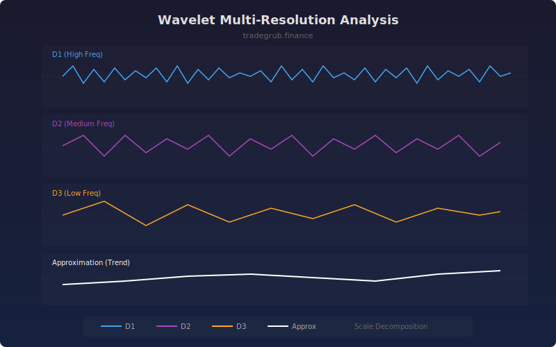

# Wavelet Multi-Resolution Analysis

Decomposes price data into multiple resolution levels using wavelet analysis. Each detail level captures price movements at a specific scale, from high-frequency noise to low-frequency trends, enabling traders to isolate and analyze market behavior at different timescales simultaneously.

## How It Works

- Applies a Haar wavelet decomposition to split price into detail and approximation coefficients
- Detail D1 captures the highest frequency (bar-to-bar noise and micro-movements)
- Each subsequent detail level captures progressively lower frequencies (longer cycles)
- The approximation component represents the smoothest underlying trend
- All components are normalized and offset for clear visual comparison

## Parameters

| Parameter | Default | Range | Description |
|-----------|---------|-------|-------------|
| Decomposition Levels | 3 | 1-5 | Number of wavelet detail levels to extract |
| Show Approximation | true | on/off | Display the smooth approximation component |

## Outputs

- **Detail D1**: Highest frequency component (blue)
- **Detail D2**: Medium frequency component (purple)
- **Detail D3**: Lower frequency component (orange)
- **Approx A**: Smooth trend approximation (white)

## Usage Notes

- When D1 and D2 align in the same direction, short-term momentum is confirmed
- The approximation line reveals the true underlying trend stripped of noise
- Large amplitude in D1 relative to D2/D3 suggests a noisy, choppy market
