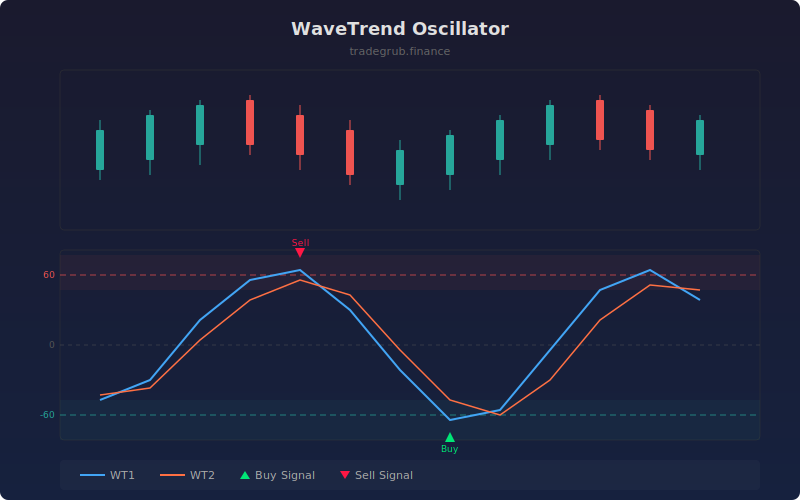

# WaveTrend Oscillator

EMA-smoothed channel-normalized oscillator designed for cycle detection and overbought/oversold analysis. It calculates a channel index from the deviation of price relative to its EMA, then smooths the result to produce two oscillating lines that generate crossover signals.

## How It Works

- Computes the EMA of the typical price (HLC3) over the channel length
- Measures the mean deviation of price from this EMA and normalizes it to create a channel index
- Smooths the channel index with a second EMA to produce the fast WaveTrend line (WT1)
- Derives a slow line (WT2) as a simple moving average of WT1
- Generates buy/sell signals when WT1 crosses WT2, with overbought/oversold zones highlighting extremes

## Parameters

| Parameter | Default | Range | Description |
|-----------|---------|-------|-------------|
| Channel Length | 9 | 1-50 | EMA period for price smoothing and deviation |
| Average Length | 12 | 1-50 | EMA period for smoothing the channel index |
| Overbought | 60 | 20-100 | Upper threshold for overbought zone |
| Oversold | -60 | -100 to -20 | Lower threshold for oversold zone |

## Outputs

- **WT1 (blue)**: Fast WaveTrend line showing smoothed momentum
- **WT2 (orange)**: Slow signal line for crossover detection
- **Green triangles**: Bullish crossover signals
- **Red triangles**: Bearish crossover signals
- **Background shading**: Overbought (red) and oversold (green) zones

## Usage Notes

- Crossover signals in oversold territory tend to produce better long entries than those near the zero line
- When both lines are above the overbought level and begin to curl down, consider tightening stops
- Works on all timeframes but signals are more reliable on higher timeframes with less noise
