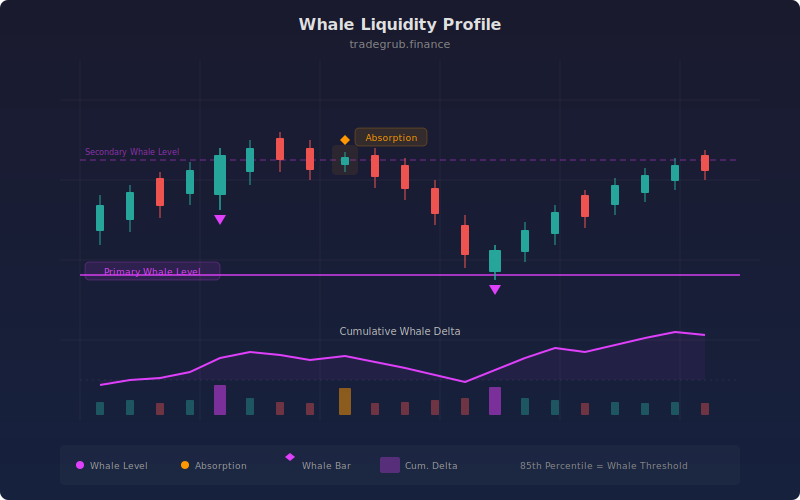

# Whale Liquidity Profile

The Whale Liquidity Profile indicator separates market volume into institutional ("whale") and retail participation using rolling percentile analysis. It identifies price levels where large players are accumulating or distributing by building horizontal volume-at-price profiles from whale-classified bars. An absorption detection layer highlights bars where unusually large volume produces minimal price movement, a hallmark of institutional positioning. The result is a multi-dimensional view of where smart money is active, where liquidity pools exist, and whether institutional flow is net bullish or bearish.

## Conceptual Diagram



## How It Works

The indicator begins by computing a rolling percentile threshold over a configurable lookback window. For each bar, it examines whether the current volume exceeds the Nth percentile (default 85th) of the recent volume distribution. Bars exceeding this threshold are classified as whale bars, representing periods of institutional-scale participation. All remaining volume is classified as retail flow.

Absorption detection identifies a distinct institutional footprint: bars where volume is disproportionately large relative to the price range. The indicator computes an absorption ratio (volume divided by high-low range) and normalizes it using a z-score against its rolling mean and standard deviation. When this z-score exceeds the configurable threshold, the bar is flagged as an absorption event. These events often precede significant directional moves as institutions finish building positions.

The volume-at-price profiling engine uses np.histogram logic to bucket the entire price range into configurable bins. Each bar's typical price (average of high, low, close) determines its bin assignment via np.digitize, and whale volume is accumulated separately from retail volume. The bin with the highest whale volume concentration becomes the primary whale level, a horizontal support/resistance line representing the price where institutions have the largest footprint. A secondary level is derived by masking the primary bin and finding the next largest.

Cumulative whale delta tracks the directional bias of institutional flow. Each whale bar's volume is signed positive (close above open, buying) or negative (close below open, selling), then cumulatively summed. A rising delta line indicates net whale accumulation; a falling line indicates distribution. This provides a running tally of institutional conviction that smooths out individual bar noise.

## Parameters

| Parameter | Default | Range | Description |
|-----------|---------|-------|-------------|
| Volume Lookback | 50 | 10-200 | Rolling window for percentile calculation |
| Whale Percentile | 85.0 | 50-99 | Volume percentile threshold for whale classification |
| Absorption Ratio Threshold | 2.0 | 0.5-10.0 | Z-score threshold for absorption detection |
| Profile Bins | 20 | 5-100 | Number of price bins for volume profile |
| Show Absorption Zones | true | - | Toggle background highlighting on absorption bars |

## Python Advantage

The whale detection engine relies on rolling percentile calculations and histogram-based profiling that have no Pine equivalent:

```python
# Rolling percentile whale detection with numpy
for i in range(vol_lookback, n):
    window = volume[i - vol_lookback:i]
    threshold = np.percentile(window, whale_percentile)
    whale_mask[i] = volume[i] >= threshold

# Volume-at-price profiling via histogram binning
bin_edges = np.linspace(price_min, price_max, profile_bins + 1)
bin_indices = np.clip(np.digitize(typical_price, bin_edges) - 1, 0, profile_bins - 1)

# Vectorized absorption ratio with safe division
absorption_ratio = volume / np.where(price_range < 1e-8, 1e-8, price_range)
absorption_z = (absorption_ratio - absorption_mean) / absorption_std_safe

# Cumulative directional whale delta
whale_delta = np.where(whale_mask, whale_volume * np.where(close > open, 1.0, -1.0), 0.0)
cumulative_whale_delta = np.cumsum(whale_delta)
```

Pine lacks np.percentile (only fixed quantile functions), np.digitize for histogram binning, and the ability to build arbitrary-resolution volume profiles from raw bar data. The conditional cumulative sum with directional signing would require dozens of lines of workaround code.

## When to Use

This indicator is most effective on liquid instruments where institutional participation is meaningful: large-cap stocks, major forex pairs, and high-volume futures contracts. It works across all timeframes but is most informative on 15-minute to daily charts where volume patterns have sufficient statistical weight. Use it to identify hidden support/resistance levels that traditional price-based analysis misses, to confirm breakout validity by checking for whale participation, and to detect stealth accumulation or distribution before price moves.

## Risk Management

Whale detection is probabilistic, not deterministic. High volume can result from retail frenzy during news events rather than institutional activity. Always confirm whale level signals with price action and other indicators. The absorption threshold should be calibrated per instrument, as different assets have different typical volume-to-range ratios. Do not use whale levels as hard stop-loss placements; treat them as zones of interest with a buffer of at least one ATR.

## Combining with Other Indicators

- **VWAP**: Compare whale accumulation levels against anchored VWAP to see if institutions are buying above or below fair value.
- **RSI or Stochastic**: Whale absorption events at oversold RSI levels often mark strong reversal zones.
- **ATR Percent**: Use ATR-based position sizing when trading off whale levels to account for current volatility regime.
