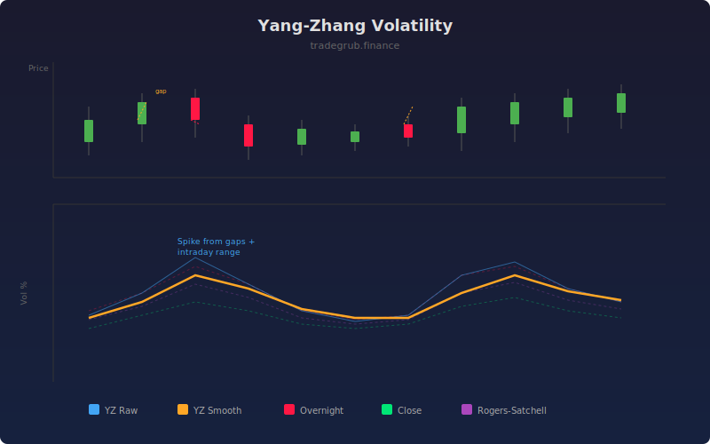

# Yang-Zhang Volatility

The Yang-Zhang volatility estimator combines overnight (close-to-open), close-to-close, and Rogers-Satchell intraday components into a single measure that handles both overnight gaps and intraday drift. It is considered one of the most accurate OHLC-based volatility estimators available.

## How It Works

- Decomposes volatility into three components: overnight variance, close-to-close variance, and Rogers-Satchell intraday variance
- Combines them with theoretically optimal weights using the k parameter
- The Rogers-Satchell component is drift-independent, making the estimator robust to trending markets
- Overnight variance captures gap risk that pure intraday estimators miss
- Annualizes and converts to percentage for direct comparison

## Parameters

| Parameter | Default | Range | Description |
|-----------|---------|-------|-------------|
| Length | 20 | 5-100 | Rolling window for variance calculation |
| Annualization Factor | 252 | 1-365 | Trading days per year |
| Smoothing | 5 | 1-20 | SMA smoothing period |
| Show Components | false | - | Display individual volatility components |

## Outputs

- **YZ Volatility**: Raw Yang-Zhang annualized volatility
- **YZ Smooth**: Smoothed version for cleaner reading
- **Overnight Vol**: Overnight gap component (optional)
- **Close Vol**: Close-to-close component (optional)
- **RS Vol**: Rogers-Satchell intraday component (optional)

## Usage Notes

- Yang-Zhang is particularly valuable for markets with significant overnight gaps (equities, futures)
- Enable component display to diagnose whether volatility is driven by gaps or intraday moves
- Compare with simpler estimators; large divergence indicates gap risk is a significant factor
