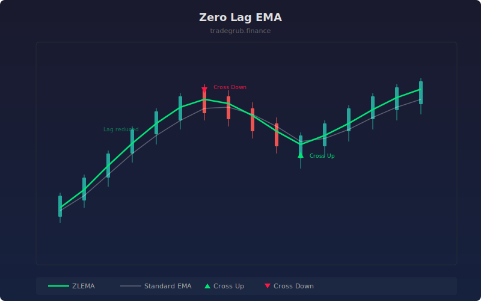

# Zero Lag EMA

EMA variant that reduces the inherent lag of exponential moving averages by adding an error correction term. It computes an EMA of the error-corrected source, producing a line that responds faster to price changes while maintaining smoothness.

## How It Works

- Computes a standard EMA of the source data
- Calculates the error as the difference between source and EMA (representing lag)
- Creates a corrected source by adding the error back: 2 * source - EMA
- Applies a second EMA pass to the corrected source, producing the zero-lag result
- Crossovers between ZLEMA and standard EMA provide trend change signals

## Parameters

| Parameter | Default | Range | Description |
|-----------|---------|-------|-------------|
| Length | 21 | 2-200 | EMA smoothing period |
| Show Standard EMA | true | - | Display the standard EMA for comparison |

## Outputs

- **ZLEMA (green)**: The zero-lag corrected EMA
- **EMA (faint white)**: Standard EMA reference line
- **Green triangles**: ZLEMA crossing above EMA
- **Red triangles**: ZLEMA crossing below EMA

## Usage Notes

- ZLEMA leads the standard EMA at turning points, giving earlier signals
- Crossovers between ZLEMA and EMA can be used as a fast trend filter
- On noisy data, the reduced lag may produce more false signals than a standard EMA
