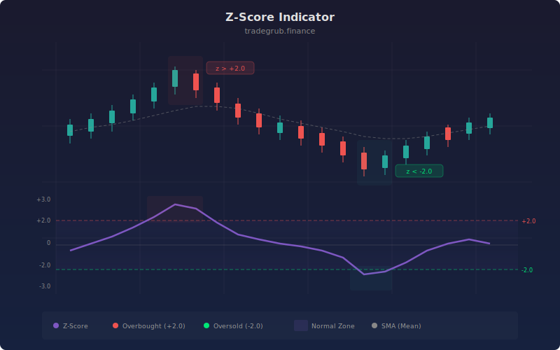

# Z-Score Indicator

The Z-Score Indicator measures how many standard deviations the current close price is from its simple moving average, providing a statistically rigorous view of price extremes. Borrowed from inferential statistics where z-scores quantify how unusual an observation is within a distribution, this indicator applies the same framework to price data, enabling traders to identify statistically significant overbought and oversold conditions with quantifiable probability thresholds.

## Conceptual Diagram



## How It Works

The indicator computes the simple moving average and standard deviation of the close price over the specified lookback period (default 20 bars). The z-score is then calculated as `(close - SMA) / StdDev`, expressing the current price as a number of standard deviations from the mean.

Under a normal distribution, approximately 68% of observations fall within 1 standard deviation, 95% within 2, and 99.7% within 3. A z-score above +2.0 means the current price is higher than approximately 97.5% of recent observations, a statistically extreme reading. A z-score below -2.0 means it is lower than 97.5% of recent observations.

The overbought and oversold thresholds are user-configurable (default +2.0 and -2.0). Horizontal reference lines mark these levels, and the area between them is filled to highlight the "normal" zone. Background shading appears when the z-score exceeds either threshold, drawing immediate attention to statistically extreme conditions.

The zero line represents the mean. Positive z-scores indicate price is above its recent average, and negative z-scores indicate it is below. The magnitude tells you how unusual the deviation is. Readings between -1 and +1 are statistically unremarkable. Readings beyond +/-2 are worth noting. Readings beyond +/-3 are rare events that typically resolve through mean reversion.

## Parameters

| Parameter | Default | Range | Description |
|-----------|---------|-------|-------------|
| Length | 20 | 5 - 200 | Lookback period for SMA and standard deviation |
| Overbought Z-Score | 2.0 | 0.5 - 4.0 | Upper threshold for extreme readings |
| Oversold Z-Score | -2.0 | -4.0 to -0.5 | Lower threshold for extreme readings |

## Python Advantage

The z-score computation is expressed as a single vectorized expression, computing the statistical normalization across the entire price history simultaneously:

```python
# Vectorized z-score computation across all bars
sma_val = ta.sma(close, length)
stdev_val = ta.stdev(close, length)
zscore = (close - sma_val) / stdev_val

# Threshold highlighting via boolean array masking
bgcolor(zscore > ob_level, color="rgba(239,83,80,0.08)")
bgcolor(zscore < os_level, color="rgba(38,166,154,0.08)")

# Fill between threshold hlines for visual "normal" zone
h_ob = hline(ob_level, title="Overbought")
h_os = hline(os_level, title="Oversold")
fill(h_ob, h_os, color="rgba(126,87,194,0.05)")
```

The expression `(close - sma_val) / stdev_val` performs element-wise subtraction and division across full numpy arrays in a single pass. You could extend this with adaptive thresholds using `np.where(stdev_val > np.percentile(stdev_val, 75), 2.5, 2.0)` to raise the z-score threshold during high-volatility periods, or compute `np.abs(zscore)` for a direction-agnostic extremity measure. The `fill` between two `hline` objects creates a shaded band between fixed levels, a visual pattern that Pine supports but Python makes more composable.

## When to Use

The Z-Score Indicator works on all timeframes and asset classes. It is most effective for mean-reversion strategies on daily and 4-hour charts during range-bound or mildly trending conditions. Use it to identify statistically extreme prices that are likely to revert toward the mean. It is less useful during strong trends where price can sustain extreme z-scores for extended periods without reverting.

## Risk Management

Extreme z-scores do not guarantee immediate reversal. In strong trends, z-scores can remain above +2 or below -2 for many bars. Use z-score readings as warnings to tighten stops or reduce exposure rather than as outright reversal signals. Place stops beyond the most recent swing extreme when entering mean-reversion trades at z-score extremes. Position size inversely to the z-score magnitude: larger positions at more extreme readings where the statistical case for reversion is stronger.

## Combining with Other Indicators

- **VWAP StdDev Bands**: Apply the z-score concept to VWAP deviations for a volume-weighted statistical extreme measure, complementing the price-only z-score.
- **Market Regime**: Only take z-score mean-reversion entries during confirmed ranging regimes. In trending regimes, extreme z-scores may indicate trend strength rather than reversion opportunity.
- **Momentum Composite**: When the z-score reaches extreme levels and the Momentum Composite confirms the same direction (overbought/oversold), the convergence strengthens the case for mean reversion.
